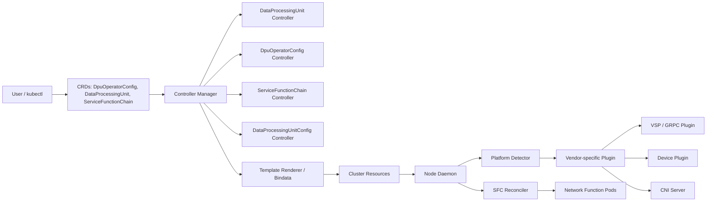

## 1. Repository structure

This repository is a Go-based Kubernetes operator for managing DPUs in an OpenShift-style environment. Its structure centers on three layers:

- Operator runtime:
  - main.go starts the controller manager and registers controllers and webhooks.
  - controller contains the main Kubernetes controllers for the custom resources.
  - daemon contains the node-side daemon that discovers DPUs, manages side managers, and runs reconcilers for service-function chains.

- API and CRD layer:
  - v1 defines the custom resource types in the `config.openshift.io/v1` API group.
  - bases contains generated CRD manifests.

- Runtime and extension layer:
  - platform detects vendor/platform characteristics and maps them to DPU plugins.
  - vendor-specific-plugins contains vendor-specific VSP implementations for Intel NetSec and Marvell.
  - render renders YAML templates from embedded bindata into Kubernetes resources.
  - images provides image resolution for operator and VSP containers.

## 2. Controllers

The repository has both cluster-side controllers and a daemon-side reconciler.

### Cluster-side controllers
- dpuoperatorconfig_controller.go
  - Reconciles `DpuOperatorConfig`.
  - Adds a finalizer, initializes status, and ensures core components are deployed:
    - DPU daemon set
    - network function NADs
    - network-resources-injector
  - Updates status conditions such as `Ready`.

- dataprocessingunit_controller.go
  - Reconciles `DataProcessingUnit`.
  - Resolves the vendor-specific VSP image and template variables.
  - Applies templated VSP resources from embedded bindata.
  - Tracks created resources for cleanup on deletion.

- servicefunctionchain_controller.go
  - Present, but currently a stub with no functional reconciliation logic.

- dataprocessingunitconfig_controller.go
  - Present, but currently a stub with no functional reconciliation logic.

### Daemon-side reconciler
- sfc.go
  - Reconciles `ServiceFunctionChain` objects on the node side.
  - Creates network-function pods with DPU resource requests and CNI annotations.

## 3. APIs

The API group is `config.openshift.io/v1`, defined in v1.

### Resource types
- `DataProcessingUnit`
  - Defined in dataprocessingunit_types.go
  - Represents a discovered or managed DPU.
  - Fields include:
    - `spec.dpuProductName`
    - `spec.isDpuSide`
    - `spec.nodeName`
    - `status.conditions`

- `DpuOperatorConfig`
  - Defined in dpuoperatorconfig_types.go
  - Cluster-scoped configuration object used to trigger installation of operator components.
  - Includes a simple `spec.logLevel`.

- `DataProcessingUnitConfig`
  - Defined in dataprocessingunitconfig_types.go
  - Intended to target DPUs via a label selector.
  - The implementation is not yet wired into reconciliation logic.

- `ServiceFunctionChain`
  - Defined in servicefunctionchain_types.go
  - Describes a chain of network functions with `nodeSelector` and a list of `networkFunctions`.

### Webhook
- dpuoperatorconfig_webhook.go
  - Validates that `DpuOperatorConfig` uses the expected standard name.

## 4. CRDs

The repository ships four CRDs under bases:

- config.openshift.io_dataprocessingunits.yaml
  - Cluster-scoped
  - `kind: DataProcessingUnit`

- config.openshift.io_dpuoperatorconfigs.yaml
  - Cluster-scoped
  - `kind: DpuOperatorConfig`

- config.openshift.io_dataprocessingunitconfigs.yaml
  - Namespaced
  - `kind: DataProcessingUnitConfig`

- config.openshift.io_servicefunctionchains.yaml
  - Namespaced
  - `kind: ServiceFunctionChain`

Information missing:
- The CRDs exist, but some of their reconciliation behavior is not implemented in the current controllers.

## 5. Reconciliation flow

The reconciliation model is split between the operator manager and the daemon.

### A. Operator-manager flow
1. main.go bootstraps the controller-runtime manager.
2. `DpuOperatorConfig` reconciliation:
   - adds a finalizer
   - initializes status
   - ensures the DPU daemonset is present
   - ensures the network-function NADs are present
   - ensures the network-resources-injector is present
3. `DataProcessingUnit` reconciliation:
   - resolves the DPU vendor/product name
   - determines the VSP image and template variables
   - renders and applies vendor-specific resources from embedded YAML
   - tracks resources for later cleanup

### B. Daemon-side flow
1. daemon.go detects hardware and creates in-memory `ManagedDpu` entries.
2. For each detected DPU, it creates or updates a `DataProcessingUnit` CR and sets ownership under `DpuOperatorConfig`.
3. It updates node labels to reflect DPU-side/host-side role and P4 path mode.
4. It starts:
   - the VSP
   - the device plugin
   - the CNI server
   - the controller manager for SFC reconciliation

### C. Service-function-chain flow
1. The daemon-side reconciler watches `ServiceFunctionChain`.
2. It checks node selector compatibility for the current node.
3. It creates network-function pods with DPU resource requests and the appropriate CNI annotations.

## 6. Extension points

The code is structured around several explicit extension seams:

- Vendor detection:
  - vendordetector.go
  - Implemented through the `VendorDetector` interface.

- Vendor-specific runtime:
  - vendorplugin.go
  - The `VendorPlugin` abstraction allows different VSP implementations.

- Vendor-specific binaries:
  - vendor-specific-plugins
  - Separate implementations exist for Intel NetSec and Marvell.

- Template-driven resource deployment:
  - render.go
  - YAML resources are embedded and rendered with variables.

- Image selection:
  - images.go
  - The operator resolves images for the daemon, NRI, and VSPs through an image manager abstraction.

- Cluster-environment adaptation:
  - cluster_environment.go
  - The operator detects cluster flavour and filesystem mode to adapt manifests.

## 7. Vendor-specific logic

The repo contains real vendor-specific behavior rather than a purely generic abstraction.

- Marvell:
  - marvell-dpu.go
  - main.go
  - Uses PCI IDs for detection and creates Marvell-specific VSP behavior, including veth pairs and dataplane setup.

- Intel NetSec Accelerator:
  - netsec-accelerator.go
  - main.go
  - Uses PCI IDs, serial numbers, and PCIe addresses to detect and configure Intel NetSec hardware, including VF setup and OvS bridge handling.

- Mock VSP:
  - mockvsp.go
  - Used for test or non-hardware scenarios.

## 8. Design philosophy

The repository follows a Kubernetes-native operator design:

- Declarative control:
  - The operator watches custom resources and drives the cluster toward the desired state.

- Separation of concerns:
  - A generic operator core handles reconciliation and resource management.
  - Vendor-specific logic is isolated behind platform and plugin abstractions.

- Host/DPU dual-role model:
  - The same operator manages both host-side and DPU-side components, using DPU CRs and node labels to distinguish roles.

- Template-based deployment:
  - Kubernetes manifests are kept in embedded bindata and rendered with environment/vendor-specific variables.

Information missing:
- The design is clear in the implementation, but some controllers and API features are still scaffold-like rather than fully fleshed out.

## 9. Mermaid architecture diagram

