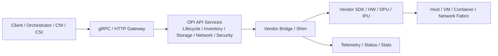

## 1. Repository structure

This repository is an API-specification and code-generation project for DPU/IPU control plane interfaces, not a full controller/operator implementation.

Top-level layout:
- README.md: project overview and scope
- CAPABILITIES.md: high-level capability goals
- lifecycle: lifecycle service definitions
- inventory: hardware inventory API
- network: networking APIs split into cloud, k8s, telco, EVPN gateway, and shared common types
- storage: storage APIs for frontend, middle-end, and backend flows
- security: security APIs, including IPsec
- go: generated Go bindings from protobufs
- buf.yaml and buf.gen.yaml: Buf-based schema generation configuration

The repository’s dominant pattern is:
- protobuf source of truth
- generated gRPC, REST gateway, and language bindings
- documentation and usage examples

## 2. Controllers

No controller implementation exists in this repository.

What is present:
- protobuf service definitions such as lifecycle and storage services
- generated gRPC server/client stubs
- HTTP annotation-based gateway mappings

What is missing:
- Kubernetes controllers
- controller-runtime reconciler loops
- operator binaries
- any Go code that watches resources and applies state changes

## 3. APIs

The repo defines a broad set of domain APIs:

- Lifecycle
  - lifecycle.proto
  - Services: initialization, device discovery, VF configuration, heartbeat

- Inventory
  - inventory.proto
  - Exposes BIOS, system, chassis, baseboard, CPU, memory, PCIe inventory

- Storage
  - frontend_nvme.proto
  - Supports NVMe subsystem/controller/namespace modeling
  - Also covers virtio, iSCSI, NVMe/TCP, QoS, encryption, and other backend concepts

- Network
  - cloudrpc.proto
  - Defines cloud-infrastructure networking objects such as devices, ports, VNics, interfaces, routes, tunnels, BGP/OSPF, policy, and more
  - Additional subdomains exist under k8s, telco, and evpn-gw

- Security
  - opi_ipsec.proto
  - IPsec-related API surface

All of these are protocol-buffer-based and are intended to be implemented by downstream vendor bridges.

## 4. CRDs

No Kubernetes CRD manifests are present in this repository.

What exists instead:
- protobuf resource-style messages with resource annotations
- generated resource names and patterns
- API semantics that resemble Kubernetes-style resources, but not actual CRD YAMLs

So the repo models resources at the API layer, not as installed Kubernetes custom resources.

## 5. Reconciliation flow

There is no implemented reconciliation flow in this repository.

The closest conceptual flow implied by the design is:

1. A client sends a desired state request through gRPC or HTTP-gateway semantics.
2. The API layer accepts the request.
3. A downstream implementation bridge translates the API call into vendor-specific SDK or device operations.
4. Status and telemetry are returned through the API.

That said, this repo does not contain:
- a reconciliation loop
- status propagation logic
- conflict resolution logic
- controller watch loops

## 6. Extension points

The repository exposes several extension points by design:

- Domain-based protobuf modules for networking, storage, lifecycle, inventory, and security
- Versioned API families such as v1 and v1alpha1
- Optional fields and oneof constructs for transport- or implementation-specific choices
- Explicit allowance for vendor-specific extensions in the documentation

These are architectural extension points rather than implemented plugin interfaces.

## 7. Vendor-specific logic

Vendor-specific logic is not implemented here.

The repo explicitly points to external reference implementations such as:
- SPDK bridge
- NVIDIA bridge
- Marvell bridge
- Intel bridge

That means this repository is the vendor-neutral contract layer, while vendor behavior lives in separate downstream implementations.

## 8. Design philosophy

The design philosophy is clearly API-first and schema-first:

- Standardize northbound interfaces across DPU/IPU vendors
- Use protobufs as the canonical contract
- Support gRPC and REST-style HTTP access through generated gateways
- Keep the contract implementation-agnostic so vendors can map it to their own SDKs and hardware
- Separate control-plane API modeling from vendor-specific execution logic

The overall intent is interoperability and portability across vendors rather than a single embedded implementation.

## 9. Mermaid architecture diagram

## Missing information

The following are not present in this repository and should be treated as absent rather than inferred:
- actual controller implementations
- Kubernetes operator code
- CRD YAMLs
- reconciliation logic
- runtime state management
- vendor-specific bridge implementations