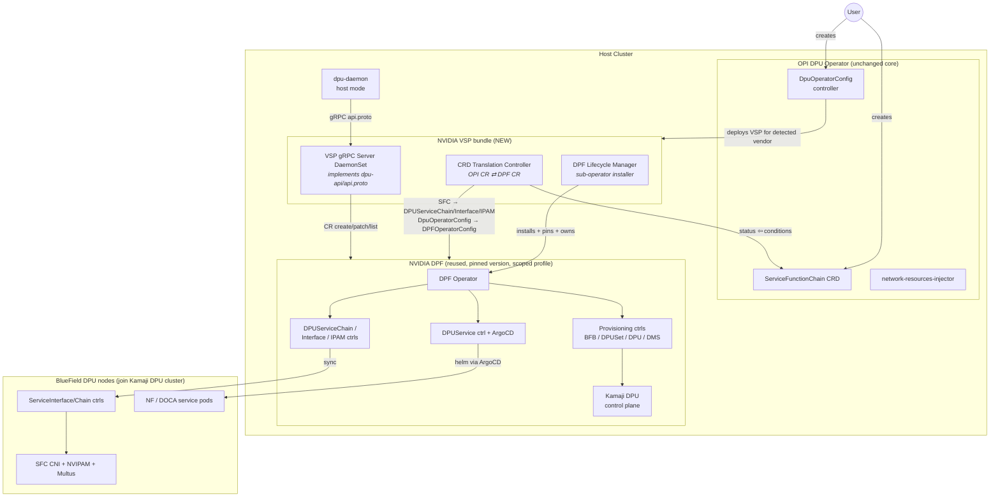
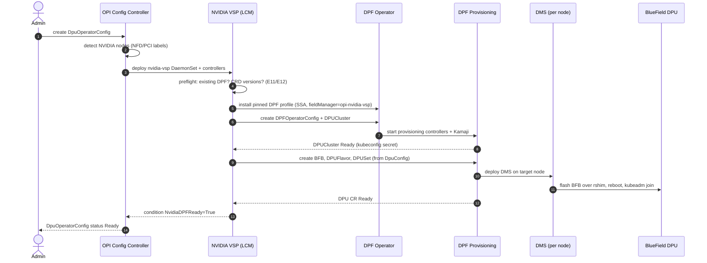
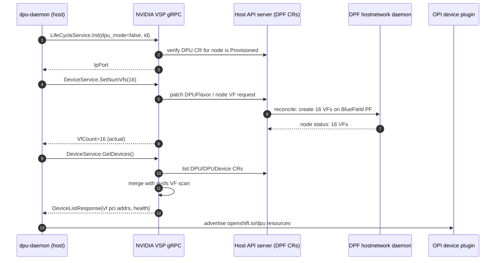
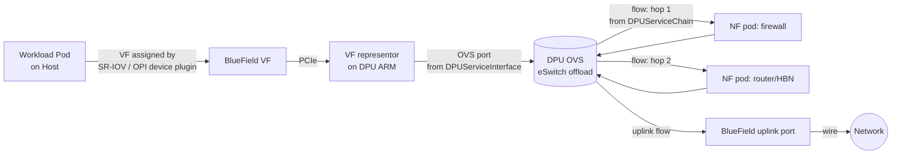

# Architecture Design: NVIDIA DPU Support for the OPI DPU Operator via DPF Integration

**Assignment:** LFX / OPI Hands-On Assignment 1 — LLM-Assisted Architecture Design
**Author:** Aditya Sarna (LLM-assisted; full prompt/response transcript in `llm_transcript.json`)
**Status:** Proposal (v1.9 — gRPC VSP daemon, CI-captured Kind/integration, BF-3 lane, 16 ADRs)

---

## Table of Contents

0. [Reviewer's TL;DR](#reviewers-tldr)
  - [Concern Closure Matrix](#concern-closure-matrix)
  - [Operational Safety Tie-Breaker](#operational-safety-tie-breaker)
  - **Start here:** [`REVIEWER.md`](REVIEWER.md) (3-min audit path) · [`repo_analysis.md`](repo_analysis.md) (upstream receipts) · [`TRANSCRIPT_INDEX.md`](TRANSCRIPT_INDEX.md) (LLM process index)
1. [Executive Summary](#1-executive-summary)
2. [Background and Current State](#2-background-and-current-state)
3. [Problem Statement and Requirements](#3-problem-statement-and-requirements)
4. [Gap Analysis: OPI Operator vs. NVIDIA DPF](#4-gap-analysis-opi-operator-vs-nvidia-dpf)
5. [Candidate Integration Patterns (Cross-Analysis)](#5-candidate-integration-patterns-cross-analysis)
  - 5.2 [Feasibility Stress-Test: Local BlueField Imperative Surface vs Declarative-Only Path](#52-feasibility-stress-test-local-bluefield-imperative-surface-vs-declarative-only-path)
6. [Recommended Architecture: Hybrid VSP-Adapter + Managed DPF Sub-Operator](#6-recommended-architecture)
7. [API and CRD Mapping](#7-api-and-crd-mapping)
   - 7.5 [NF Image to DPUService Mapping — v1 Decision (Q-D closed)](#75-nf-image-to-dpuservice-mapping--v1-decision-q-d-closed)
   - 7.6 [Validation: Upstream Source Cross-References](#76-validation-upstream-source-cross-references)
8. [Sequence Diagrams](#8-sequence-diagrams)
9. [Reconciliation Semantics](#9-reconciliation-semantics)
10. [Failure Modes and Edge-Case Analysis](#10-failure-modes-and-edge-case-analysis)
11. [Security Analysis](#11-security-analysis)
12. [Trade-off Analysis Summary](#12-trade-off-analysis-summary)
   - 12.3 [Control-Plane Resource Footprint and Overhead Analysis](#123-control-plane-resource-footprint-and-overhead-analysis)
13. [Upgrade, Versioning and Lifecycle Strategy](#13-upgrade-versioning-and-lifecycle-strategy)
14. [Testing Strategy](#14-testing-strategy)
15. [Phased Implementation Plan](#15-phased-implementation-plan)
  - 15.1 [Implementation Readiness Checklist](#151-implementation-readiness-checklist)
16. [Resolved Decisions and Remaining Community Questions](#16-resolved-decisions-and-remaining-community-questions)
   - 16.3 [Assumptions](#163-assumptions)
17. [Appendix A: Bonus Go Skeleton Overview](#17-appendix-a-bonus-go-skeleton-overview)
18. [Appendix B: Architecture Decision Records (ADR Log)](#18-appendix-b-architecture-decision-records-adr-log)
19. [Appendix C: OPI ↔ DPF Glossary and Semantic Contract](#19-appendix-c-opi--dpf-glossary-and-semantic-contract)

---

## Reviewer's TL;DR

This proposal integrates NVIDIA BlueField support into the OPI DPU operator by reusing DPF rather than reimplementing DOCA-side logic. The chosen pattern is a hybrid: NVIDIA VSP adapter + managed DPF sub-operator + CRD translation controller. The hardest remaining engineering problem is bidirectional version drift across OPI and DPF CRD evolution — not chain mapping. **BP1 is closed:** BlueField-local imperative control for service chains does not exist as a DPF-endorsed integration surface; the VSP actuates exclusively through DPF CRs on the host-cluster Kubernetes API (§5.2). OPI owns intent, DPF owns hardware truth, the VSP owns translation.

### Concern Closure Matrix

| Concern raised | Status | Proof location |
|---|---|---|
| BP1: stable BlueField-local imperative API for SFC/OVS? | **Closed** — declarative DPF-CR path only | §5.2; ADR-009 |
| Topology: OPI two-cluster vs DPF Kamaji (G3, E1) | **Closed** — `DPFNative` / `OPIConverged` modes | §6.3; ADR-002; E1/E22 |
| `CreateNetworkFunction` caller location (Mode A attach) | **Closed** — DPU-side only; Mode A is declarative | §7.6; §8.3–8.4; ADR-008 |
| Host VF dual-writer hazard (E7) | **Closed** — DPF hostnetwork sole writer | §9.1; §10 E7 |
| `bridge_id` / NFRequest semantics (E20) | **Closed** — normative grammar proposed | §7.4b; ADR-005 |
| NF image → `DPUService` impedance (Q-D) | **Closed** — `opi-nf-wrapper` chart (ADR-010) | §7.5; `charts/opi-nf-wrapper/`; golden `testdata/golden/sfc-web-chain.yaml` |
| Bidirectional OPI↔DPF version drift (Q-E) | **Closed** — matrix SSOT + `VersionIncompatible` gate (ADR-012) | `config/nvidia/compatibility.yaml`; §13.1; `TestVersionCompatibilityController` |
| DPF packaging: baked-in vs pull-time (Q-A) | **Closed** — baked-in bundle (ADR-011) | `config/nvidia/dpf-bundle.yaml`; §13.1 |
| Shared VSP framework extraction (Q-B) | **Closed** — defer until second vendor (ADR-013) | §16.2; ADR-013 |
| Zero-Trust mode (Q-C) | **Closed** — Host-Trusted v1; post-GA (ADR-014) | §11; ADR-014 |
| Multi-DPU-per-host-node (N:1) | **Closed** — 1:1 v1 scope (ADR-015) | §16.3 A8; ADR-015 |
| Force-cleanup finalizer escape (E21) | **Closed** — audited annotation gate | §8.5; §10 E21 |
| Brownfield DPF adoption (E11) | **Closed** — adopt, never fight | §6.2-1; ADR-003 |

### Operational Safety Tie-Breaker

Under real incident conditions this design is safer than native reimplementation (Pattern A) or a controller-only bridge (Pattern D) because **data-plane state survives control-plane loss** and **writers are mechanically bounded**. Concrete scenario: Kamaji tenant control plane becomes unreachable mid-upgrade while an SFC is active. Already-programmed OVS eSwitch flows keep forwarding (§8.7, E2); the VSP flips `ProvisioningDegraded`, returns `UNAVAILABLE` on new attaches, and blocks destructive reprovision until conditions clear — pods already on the chain are not torn down. Recovery: restore host-CP HA for Kamaji pods (PDB + priorityClass), wait for TCP readiness, then let the level-triggered translator re-sync derived CRs; no manual OVS surgery and no second writer racing DPF hostnetwork on VFs. Pattern A would make OPI maintainers sole owners of that failure surface across every DOCA/firmware churn cycle.

## 1. Executive Summary

This document proposes an architecture for adding **NVIDIA BlueField DPU support** to the **OPI DPU operator** (as embodied today in `openshift/dpu-operator`, which uses OPI APIs and a vendor-neutral Vendor Specific Plugin — VSP — model) while **maximizing reuse of NVIDIA's existing DOCA Platform Framework (DPF) operator** (`NVIDIA/doca-platform`).

After cross-analyzing five candidate integration patterns, the recommended design combines three mechanisms:

> [!TIP]
> ### The Hybrid Architectural Triad
> 1. **NVIDIA VSP (Adapter Pattern)** — a new Vendor Specific Plugin that implements the OPI operator's existing gRPC vendor-plugin contract (`LifeCycleService`, `DeviceService`, `NetworkFunctionService`, `DpuNetworkConfigService`, `HeartbeatService`) and translates every call into DPF Custom Resources instead of talking to hardware directly.
> 2. **Managed DPF Sub-Operator (Meta-Operator Pattern)** — the OPI operator's `DpuOperatorConfig` controller detects NVIDIA hardware (or explicit configuration) and installs/owns a *scoped* subset of the DPF operator (provisioning + service-chain controllers) as a managed dependency, exactly as OLM-style meta-operators manage operand operators.
> 3. **CRD Translation Controller (Anti-Corruption Layer)** — a bidirectional, level-triggered controller inside the NVIDIA VSP that maps OPI-facing CRs (`ServiceFunctionChain`, `DpuOperatorConfig`) to DPF CRs (`DPUServiceChain`, `DPUServiceInterface`, `DPUSet`, `BFB`, `DPFOperatorConfig`) and propagates status/conditions back.

The architecture is intentionally simple to remember: OPI keeps ownership of intent, DPF keeps ownership of hardware truth, and the VSP is where translation (not reimplementation) happens.

---

## 2. Background and Current State

### 2.1 OPI DPU Operator (current architecture)

The OPI-aligned DPU operator (`openshift/dpu-operator`) manages DPUs vendor-agnostically:

| Component | Placement | Role |
|---|---|---|
| `dpu-operator-controller-manager` | Host cluster | Reconciles `DpuOperatorConfig`; deploys daemons and VSPs |
| `dpu-daemon` (DaemonSet) | Every host + DPU node (label `dpu=true`) | Node-level agent; host-side ("host mode") or DPU-side ("dpu mode"); CNI glue |
| **VSP** (Vendor Specific Plugin, DaemonSet) | Nodes with vendor HW | Vendor-specific gRPC server the daemon calls; Intel/Marvell/NVIDIA shims |
| `dpu-cni` | Host + DPU nodes | CNI plugin wiring pod interfaces to DPU-accelerated ports |
| `network-resources-injector` | Host cluster | Mutating webhook injecting DPU resource requests into workload pods |

#### User-Facing CRDs (OPI side)
- **`DpuOperatorConfig`** — Top-level cluster-scoped singleton; activates DPU support and selects topological mode.
- **`ServiceFunctionChain` (SFC)** — Declares chain of network functions to program on target DPUs.
- **`DpuConfig` / `DpuNetwork`** — Per-node device hardware and logical network configuration models.

> [!NOTE]
> **The VSP gRPC Contract** (`dpu-api/api.proto`, package `Vendor`) defines the stable, vendor-neutral interface boundary of the OPI operator architecture:

```protobuf
service LifeCycleService {
  rpc Init(InitRequest) returns (IpPort);
}
service DeviceService {
  rpc GetDevices(Empty) returns (DeviceListResponse);
  rpc SetNumVfs(VfCount) returns (VfCount);
}
service NetworkFunctionService {
  rpc CreateNetworkFunction(NFRequest) returns (Empty);
  rpc DeleteNetworkFunction(NFRequest) returns (Empty);
}
service DpuNetworkConfigService {
  rpc SetDpuNetworkConfig(DpuNetworkConfigRequest) returns (Empty);
}
service HeartbeatService {
  rpc Ping(PingRequest) returns (PingResponse);
}
```

*Flow: `dpu-daemon` discovers its VSP, calls `Init`, then `GetDevices`, `SetNumVfs`, and per-pod `CreateNetworkFunction`.*

### 2.2 NVIDIA DPF (DOCA Platform Framework)

DPF is NVIDIA's standalone operator suite targeting BlueField DPUs. It manages:

*   **Operator Control**: `DPFOperatorConfig` configuring global system controllers.
*   **Provisioning & Hardware**: `BFB` (firmware images), `DPUFlavor` (perf profile), `DPUSet` / `DPU` (host flashing/node lifecycle), and Kamaji control plane clusters.
*   **Service & Chains**: `DPUService` (Helm-chart based apps delivered via ArgoCD), `DPUServiceChain` (logical OVS chains), and `DPUServiceInterface` (attachment points).

> **Kamaji dual-cluster model**: DPF requires DPU nodes join a Kamaji tenant control plane hosted inside the host cluster — explicit mediation required (§6.3).

### 2.3 The Core Design Goal

> **Why not just tell users to run DPF directly?**
>
> The mission of OPI is **unified, vendor-neutral API management**. Admins use the same `DpuOperatorConfig` and `ServiceFunctionChain` regardless of whether nodes host Intel IPUs, Marvell OCTEON cards, or NVIDIA BlueField DPUs. Coexistence of multi-vendor cards in the same cluster must be seamless. Directly exposing DPF APIs to the end-user breaks the vendor-agnostic contract.

---

## 3. Problem Statement and Requirements

### 3.1 Problem Definition

Add **NVIDIA BlueField support** to the OPI operator while **maximizing reuse of the upstream DPF operator**, isolating vendor-specific complexity behind the standard VSP boundary without leaking Mellanox/NVIDIA API types to the user.

### 3.2 Architectural Requirements

> [!TIP]
> #### Functional Requirements (FR)
> *   **FR1 (Single-UX)**: `DpuOperatorConfig` alone must bring up NVIDIA support without manual DPF install.
> *   **FR2 (SFC Translation)**: `ServiceFunctionChain` must map automatically to DPF service chain custom resources.
> *   **FR3 (VSP contract)**: Fully implement `dpu-api` gRPC services for the BlueField node lifecycle.
> *   **FR4 (Discovery)**: Device VFs and SFs must be discovered and registered dynamically for pod allocation.
> *   **FR5 (Coexistence)**: Support mixed-vendor clusters (Intel + Marvell + NVIDIA) running concurrently.
> *   **FR6 (Status Propagation)**: Surface detailed DPF conditions and provisioning errors onto OPI CR status.
> *   **FR7 (Deterministic Teardown)**: Bounded, finalizer-guaranteed cascading garbage collection.

> [!IMPORTANT]
> #### Non-Functional Requirements (NFR)
> *   **NFR1 (Zero-Fork)**: Consume DPF as an unmodified versioned upstream dependency.
> *   **NFR2 (Anti-Corruption Boundary)**: Zero leaking of DPF custom types to the OPI API surface.
> *   **NFR3 (Declarative Drift Correction)**: Level-triggered reconciliation loops with drift self-healing.
> *   **NFR4 (Decoupled Upgrades)**: Independent release cycles matching a two-dimensional matrix.
> *   **NFR5 (Least-Privilege RBAC)**: Strict namespace scoping for the translator ServiceAccount. The VSP gets access only to DPF CRs it owns.

**Explicit non-goals (v1)**

- Re-implementing DOCA/DMS hardware flashing in OPI.
- Exposing DPF's full `DPUService` helm-chart surface through OPI APIs (only the SFC/NF subset).
- Zero-Trust mode (DPU-managed-independently); v1 targets Host-Trusted mode.

---

## 4. Gap Analysis: OPI Operator vs. NVIDIA DPF

A capability-by-capability cross-analysis. This drives which pattern component handles each concern.

| # | Capability | OPI operator today | DPF today | Gap / Integration decision |
|---|---|---|---|---|
| G1 | Enable/disable system | `DpuOperatorConfig` CR | `DPFOperatorConfig` CR + helm | **Translate**: OPI config controller generates `DPFOperatorConfig` (sub-operator pattern) |
| G2 | DPU OS/image provisioning | Out of scope for Intel/Marvell VSPs (assumed pre-provisioned) | First-class: `BFB`, `DPUSet`, `DPU`, DMS flashing | **Delegate entirely to DPF**; optionally expose minimal knobs via `DpuConfig` extension |
| G3 | DPU K8s control plane | External: user brings 2nd cluster (e.g., MicroShift on DPU) | Internal: Kamaji tenant control plane | **Topology adapter needed** — biggest structural mismatch; see §10 (E1–E4) |
| G4 | Node agent | `dpu-daemon` on host+DPU | DPF host agents (hostnetwork config, DMS) + DPU-cluster controllers | Both coexist; VSP mediates. Careful: both touch host VFs → single-writer rule (§10 E7) |
| G5 | VF lifecycle | `DeviceService.SetNumVfs` via VSP | `DPUFlavor` + hostnetwork daemon create VFs | **Translate**: `SetNumVfs` → patch `DPUFlavor`/`DPUSet`; report actual from `DPU` status |
| G6 | Device inventory | `DeviceService.GetDevices` → device plugin | `DPUDevice`/`DPU` status, node feature discovery labels | **Translate**: VSP lists DPF `DPU`/`DPUDevice` CRs + local sysfs for VF enumeration |
| G7 | Per-pod NF attach | `NetworkFunctionService.CreateNetworkFunction(input, output, bridge_id)` | `DPUServiceInterface` + `DPUServiceChain` (OVS ports/flows) | **Translate**: NFRequest → generated `DPUServiceInterface` pair + `DPUServiceChain` entry |
| G8 | Service function chains | `ServiceFunctionChain` CRD (pod images on DPU) | `DPUService` (helm) + `DPUServiceChain` | **Translate**: SFC → wrapper `DPUService` (generated minimal helm values) + chain CRs |
| G9 | IPAM on DPU | Delegated to CNI | `DPUServiceIPAM` (NVIPAM) | VSP generates `DPUServiceIPAM` when SFC requests subnets |
| G10 | Health | `HeartbeatService.Ping` | CR conditions, ArgoCD sync state | VSP Ping aggregates: DPF controller health + owned-CR conditions |
| G11 | Accelerated mode toggle | `SetDpuNetworkConfig(is_accelerated)` | OVN-offload DPUService | **Translate**: toggles generation of the OVN/HBN offload `DPUService` |
| G12 | Deletion/cleanup | Delete `DpuOperatorConfig` restores state | Finalizers on all DPF CRs | Ownership chain + finalizers must span the translation boundary (§10 E10) |

**Gap analysis conclusion:** every gap resolves at the VSP/CRD translation layer; none requires DPF internals changes. G3 (topology) and G4 (dual node agents) need explicit conflict-avoidance rules (§6.3, §9.1).

---

## 5. Candidate Integration Patterns (Cross-Analysis)

Five patterns were stress-tested (transcript turns 3–8) against requirements and failure scenarios.

### Pattern A — Full Native Reimplementation

Direct DOCA/rshim/OVS — no DPF.

- Pros: single binary; uniform with Marvell VSP style.
- Cons: re-implements BFB/Kamaji/ArgoCD/NVIPAM/SFC CNI; permanent NVIDIA-logic fork; violates reuse goal.
- **Verdict: rejected.** Fails NFR1.

### Pattern B — Pure Adapter VSP (user installs DPF)

VSP translates gRPC → DPF CRs; admin installs DPF separately.

- Pros: minimal code; total DPF reuse.
- Cons: dual install UX (violates FR1); unmanaged version skew (E12); no teardown owner.
- **Verdict: insufficient alone** — translation core retained.

### Pattern C — Sub-Operator (OPI installs and owns DPF)

OPI deploys pinned, scoped DPF as an operand (OLM-style meta-operator).

- Pros: FR1 satisfied; version pinning; clean teardown.
- Cons: does not connect data path — still needs Pattern B's adapter.
- Risk: pre-existing DPF → adoption protocol (E11).
- **Verdict: necessary but not sufficient.**

### Pattern D — Standalone CRD Translation Layer (no VSP)

Controller-only bridge; `dpu-daemon` bypassed on NVIDIA nodes.

- Pros: purely declarative.
- Cons: breaks plugin model — `GetDevices`/`SetNumVfs`/`CreateNetworkFunction` are synchronous, node-local, CNI-blocking; diverges from Intel/Marvell precedent.
- **Verdict: rejected as primary mechanism** — CR-mapping logic retained inside VSP.

### Pattern E — Hybrid (Recommended)

C's lifecycle ownership + B's gRPC adaptation + D's CR mapping, packaged as one NVIDIA VSP artifact.

- Pros: meets FR1–FR7, NFR1–NFR5 (§12.2).
- Costs: three internal sub-components; Kamaji topology adapter (G3).
- **Verdict: adopted.** Detailed in §6.

### 5.1 Auditable Decision Rubric and Matrix

To avoid "decorative scoring", this matrix is computed from an explicit rubric:

- Score scale per criterion: `0..5` where
  `0` = fails hard requirement,
  `1` = major redesign required,
  `2` = workable with substantial risk,
  `3` = acceptable with known trade-offs,
  `4` = strong fit,
  `5` = best-fit with no major caveat.
- Total formula: `weighted_total = Σ(score_i × weight_i)`.
- Weight rationale:
  `DPF reuse` and `Single OPI UX` are `x3` because they are the assignment's primary objective and FR1-critical path.
  `Fits VSP plugin model`, `K8s-operator idiomatic`, and `Maintenance burden` are `x2` because they drive implementation risk and long-term operability.
  `Failure containment` and `Mixed-vendor support` are `x1` because they are mandatory gates, but not the primary differentiator between surviving options.

Audit notes for disputed choices:

- `Fits VSP plugin model` is `x2` (not `x3`) because it is already partially captured by `Single OPI UX`; setting both to `x3` would double-count plugin-surface concerns.
- `Failure containment` stays `x1` because any option scoring `<3` is rejected regardless of total; it is a gate plus a tie-breaker, not a primary optimizer.

| Criterion (weight) | A: Native | B: Pure adapter | C: Sub-operator | D: CRD bridge | **E: Hybrid** |
|---|---|---|---|---|---|
| DPF reuse (×3) | 1 | 5 | 4 | 5 | **5** |
| Single OPI UX / FR1 (×3) | 5 | 2 | 5 | 3 | **5** |
| Fits VSP plugin model (×2) | 5 | 4 | 2 | 1 | **5** |
| K8s-operator idiomatic (×2) | 3 | 3 | 4 | 5 | **5** |
| Maintenance burden, inverted (×2) | 1 | 4 | 3 | 3 | **4** |
| Failure-mode containment (×1) | 3 | 2 | 3 | 3 | **4** |
| Mixed-vendor support (×1) | 4 | 4 | 4 | 2 | **5** |
| **Weighted total (max 70)** | 42 | 48 | 53 | 46 | **67** |

Pass/fail gates applied before totals (non-negotiable):

- Any pattern scoring `<3` on `Single OPI UX` or `Fits VSP plugin model` is non-viable for OPI integration.
- Any pattern scoring `<3` on `Failure-mode containment` is non-viable for production.

Under these gates, Pattern E remains the only option with no criterion below `4`.

### 5.2 Feasibility Stress-Test: Local BlueField Imperative Surface vs Declarative-Only Path

**BP1 status: CLOSED.** Implementation may proceed on the declarative-through-DPF-CR path documented below.

#### Evidence block (source-closed)

| # | Source pointer | What it proves |
|---|---|---|
| E-BP1-1 | [DPF `component-description.md`](https://github.com/NVIDIA/doca-platform/blob/public-main/docs/public/developer-guides/architecture/component-description.md) — Provisioning vs DPUServiceChain sections | **DMS** (local gRPC on host/DPU) is scoped to BFB flash/reboot under the **DPU controller**; **OVS ports/flows** are created by **ServiceInterface/ServiceChain controllers** reconciling **Kubernetes objects** on the DPU cluster — not by an external imperative API |
| E-BP1-2 | [DPF `system-overview.md`](https://github.com/NVIDIA/doca-platform/blob/public-main/docs/public/developer-guides/architecture/system-overview.md) — DPUServiceChain system steps 1–4 | User creates `DPUServiceInterface`/`DPUServiceChain` CRs → host controllers sync to DPU cluster → node controllers program OVS. No third-party local socket API in the actuation path |
| E-BP1-3 | [DPF `dpuservicechain.md`](https://github.com/NVIDIA/doca-platform/blob/public-main/docs/public/developer-guides/api/dpuservicechain.md) | `DPUServiceChain` lifecycle is CR-reconcile driven; conflicts surface on `ServiceChain` conditions, confirming CRs are the system of record |
| E-BP1-4 | [NVIDIA DMS Guide](https://docs.nvidia.com/doca/sdk/DOCA-Management-Service-Guide/index.html) — gNMI/gNOI on BlueField ARM | A **real local gRPC surface exists**, but it is **OpenConfig device management** (config/ops: reset, firmware, device params) — **not** service-function-chain or per-pod OVS attach semantics |
| E-BP1-5 | [NVIDIA Developer Forums — `doca_grpc` deprecated ≥2.9.0](https://forums.developer.nvidia.com/t/running-doca-grpc-server-with-nvidia-bluefield-3/352096) | Legacy generic `doca_grpc` is **not shipped in production BFBs**; not a viable VSP integration surface |
| E-BP1-6 | `openshift/dpu-operator` — §7.6 call-path verification | OPI's synchronous NF attach is a **host↔VSP gRPC** contract; even Mode B "imperative" RPC resolves to **DPF CR create/patch on the host API server**, not a direct BlueField ARM daemon call for chain programming |

#### Final decision and design impact

| Question | Answer |
|---|---|
| Is there a stable, DPF-endorsed **local imperative API** the VSP should call on BlueField ARM for SFC/OVS/VF lifecycle? | **No.** Actuation path is **host-cluster Kubernetes API → DPF controllers → DPU-side reconcile → OVS**. |
| Is DMS relevant? | **Yes, but only inside DPF provisioning** (BFB/DMS/rshim). The VSP must **not** bypass DPF to invoke DMS for chain programming. |
| What about Mode B `CreateNetworkFunction`? | Still **CR-mediated**: VSP upserts `DPUServiceInterface`/`DPUServiceChain` via the host API; DPF syncs and programs OVS. "Imperative" describes the OPI daemon↔VSP latency contract, not a BlueField-local control plane. |

**Impacts locked by this closure:** Mode A attach stays declarative via SFC translation (§8.3); Mode B retains bounded-sync CR upserts (§8.4); no follow-on ADR is required for a direct BlueField socket path unless NVIDIA publishes SFC-native OpenConfig/gNMI models (none documented today). Phase 0 may start immediately; Phases 3–4 implement CR translation, not DOCA SDK discovery on ARM.

---

## 6. Recommended Architecture

### 6.1 Component View



### 6.2 The three sub-components of the NVIDIA VSP

**(1) DPF Lifecycle Manager (LCM)** — renders pinned scoped DPF profile (feature-gated); SSA with field manager `opi-nvidia-vsp`; adoption protocol for brownfield DPF (E11/E12).

**(2) CRD Translation Controller** — level-triggered bidirectional map: OPI CRs ↓ DPF CRs; DPF conditions/ArgoCD ↑ OPI conditions; ownerReferences + finalizers for deterministic GC.

**(3) VSP gRPC server** — implements `dpu-api/api.proto` per node:

| RPC | NVIDIA implementation |
|---|---|
| `LifeCycleService.Init(dpu_mode, dpu_identifier)` | Registers node; on host-mode: verifies matching `DPU` CR exists/provisioned; returns serving IpPort |
| `DeviceService.GetDevices` | Merges DPF `DPU`/`DPUDevice` CR status with local sysfs VF enumeration → OPI `Device` list (ID = VF PCI addr, health from DPU conditions) |
| `DeviceService.SetNumVfs(n)` | Patches node's `DPUFlavor`/host network config request; waits (bounded) for DPF hostnetwork daemon to actuate; returns *actual* count |
| `NetworkFunctionService.CreateNetworkFunction(in,out,bridge)` | **Topology-dependent**: in `OPIConverged` (Mode B), valid imperative path from DPU-side `dpu-daemon`, creating/updating node-scoped `DPUServiceInterface` + `DPUServiceChain` hop with bounded idempotent wait; in `DPFNative` (Mode A), this RPC has no in-tree caller and SFC attach is driven by declarative `ServiceFunctionChain` watch translation (§8.3, §8.4) |
| `NetworkFunctionService.DeleteNetworkFunction` | **Topology-dependent** counterpart to create: active in Mode B via DPU-side daemon; in Mode A, detach follows declarative CR reconciliation rather than imperative per-pod RPC |
| `DpuNetworkConfigService.SetDpuNetworkConfig(is_accelerated)` | Enables/disables generation of the OVN-offload `DPUService` |
| `HeartbeatService.Ping` | Healthy ⇔ (DPF deployments Available) ∧ (owned CRs not Degraded) ∧ (Kamaji control plane reachable) |

### 6.3 Topology: two fully-specified, selectable modes (resolving gap G3)

OPI supports "two clusters" (host cluster + DPU cluster e.g. MicroShift) and "one cluster" modes;
DPF *requires* its DPU nodes to join a DPF-managed control plane (Kamaji). Rather than defer the
reconciliation of these models, this design specifies **two complete, selectable topology modes**
chosen by `DpuOperatorConfig.spec.nvidia.dpuTopology` (`DPFNative` default, or `OPIConverged`).
Both are architected here; the single-writer rules (§9.1) hold in both.

#### Mode A — `DPFNative` (default, recommended for GA)

The DPU-side control plane is the **Kamaji tenant control plane** created by DPF. `dpu-daemon`
does **not** run on BlueField ARM cores; DPU-side duties (OVS ports/flows, CNI, IPAM) are
fulfilled by DPF's DPU-cluster controllers, driven by the translation layer on the host.

Upstream call-path verification (see §7.6) shows `NetworkFunctionService.CreateNetworkFunction`
is invoked only from `internal/daemon/dpusidemanager.go` in the DPU-side daemon path. Therefore,
under Mode A (no DPU-side daemon), per-pod imperative NF attach is not a valid trigger path; the
effective attach path is the declarative `ServiceFunctionChain` translation flow (§8.3).

- **Pros:** verbatim reuse of the entire DPF DPU-side stack; zero dual-writer OVS risk;
  single resident control plane on the constrained ARM SoC; smallest new code surface.
- **Cons:** OPI DPU-side daemon features (e.g., a future OPI-native SFC agent) are unavailable
  on NVIDIA nodes; two control-plane shapes coexist across a mixed-vendor fleet.
- **Who owns the DPU node:** DPF (Kamaji). OPI observes via translated CR status only.

#### Mode B — `OPIConverged` (specified for uniform-fleet deployments)

The OPI `dpu-daemon` is packaged **as a DPF `DPUService`** (helm chart) so DPF *delivers* the OPI
agent onto the DPU node it already provisioned and joined. This converges the models: DPF still
owns hardware provisioning and the DPU K8s node, but the OPI daemon runs on the DPU and speaks the
normal `dpu-api` contract in `dpu_mode=true`.

- **Contract for coexistence (mandatory):** on a Mode-B DPU node, the OPI daemon is granted a
  **bounded resource domain** — it may program OVS *bridges/ports it created* (namespaced by an
  `opi-` bridge prefix) and manage VF representors handed to it, but it must **never** touch the
  DPF-managed uplink bridge, the DPF hostnetwork VFs, or DPF's OVS flows. This is enforced by
  (a) an OVS bridge-name allow-list injected into the daemon's config by the translator, and
  (b) a `ValidatingAdmissionPolicy` on the DPU cluster rejecting `ServiceInterface`/`ServiceChain`
  writes from the OPI daemon's ServiceAccount outside its prefix. This makes E7 (dual-writer)
  structurally impossible rather than merely discouraged.

  Compatibility note for distributions where `ValidatingAdmissionPolicy` is unavailable or
  feature-gated off: the same policy is enforced by a namespaced validating admission webhook
  shipped with the NVIDIA VSP bundle, with RBAC as an additional guardrail (the OPI daemon
  ServiceAccount gets write verbs only for `opi-*` prefixed resources via label/selector-scoped
  admission checks). This fallback is functionally equivalent for E7 mitigation and is the
  default when policy API discovery does not find `admissionregistration.k8s.io/v1`
  `ValidatingAdmissionPolicy` support.
- **Pros:** one operational model across all vendors; OPI DPU-side features work on BlueField.
- **Cons:** larger ARM footprint (daemon + DPF DPU-cluster agents); requires the coexistence
  contract above; more moving parts to certify.

#### Selection and migration

| | Mode A `DPFNative` | Mode B `OPIConverged` |
|---|---|---|
| DPU control plane | DPF/Kamaji | DPF/Kamaji |
| `dpu-daemon` on DPU | no | yes (as `DPUService`) |
| OVS on DPU written by | DPF controllers only | DPF (uplink) **+** OPI daemon (prefixed bridges) |
| Dual-writer defense | N/A (single writer) | bridge allow-list + admission policy |
| Recommended for | first GA, minimal risk | homogeneous fleets wanting OPI DPU features |

Migration A→B is **non-destructive**: enabling `OPIConverged` on a provisioned node only *adds* the
`dpu-daemon` DPUService; the DPF-owned uplink is untouched, so no reprovision or traffic hit is
required. B→A removes the DPUService and its prefixed bridges. Both transitions are level-triggered
by the translator and gated on a per-node drain of OPI-owned interfaces.

See ADR-002 (§18) for the full decision record. This removes the previously-open topology question
from §16.

---

## 7. API and CRD Mapping

### 7.1 Control-plane mapping

| OPI object / field | DPF object / field | Direction | Notes |
|---|---|---|---|
| `DpuOperatorConfig` (created) | DPF install + `DPFOperatorConfig` | ↓ | LCM renders pinned profile |
| `DpuOperatorConfig.spec.mode` | `DPFOperatorConfig` feature gates | ↓ | host-trusted only in v1 |
| `DpuConfig` (vendor section `nvidia.bfbURL`) | `BFB.spec.url` | ↓ | optional; default BFB shipped in profile |
| `DpuConfig` (vendor `nvidia.flavor`) | `DPUFlavor` | ↓ | perf/VF profile |
| node label `dpu=true` ∧ NFD `feature.node…/bluefield` | `DPUSet.spec.nodeSelector` | ↓ | drives per-node `DPU` creation |
| `DpuOperatorConfig.status.conditions` | aggregate of `DPFOperatorConfig`, `DPUCluster`, `DPU` conditions | ↑ | see condition table §9.3 |

### 7.2 Data-plane / SFC mapping

| OPI | DPF | Cardinality |
|---|---|---|
| `ServiceFunctionChain` | one `DPUServiceChain` + one generated `DPUService` (wrapper helm chart embedding NF images) | 1 → 1+1 |
| SFC network function entry (image, name) | helm value entry in wrapper `DPUService`; pod on DPU via ArgoCD (Warning: open design question — see §7.5) | 1 → 1 |
| implicit NF ingress/egress ports | `DPUServiceInterface` (type `service`) | 1 NF → 2 |
| `NFRequest{input, output, bridge_id}` (gRPC, per-pod) | node-scoped `DPUServiceInterface` pair + chain hop | 1 → 2+patch |
| SFC IP requirements | `DPUServiceIPAM` | 0..1 |

### 7.2.1 `DPUDeployment` vs granular CRs (production path)

DPF exposes both **`DPUDeployment`** (aggregate: services + chain + selectors) and lower-level
`DPUService` / `DPUServiceChain` / `DPUServiceInterface` / `DPUServiceIPAM`. This design uses
**granular CRs in v1** because they map 1:1 to OPI `ServiceFunctionChain` hops, enable per-object
SSA drift correction (§9.1), and power the golden contract in `testdata/golden/sfc-web-chain.yaml`.

**Production rollout (ADR-016):** after provisioning parity, add a **`DPUDeployment` render mode**
behind `compatibility.yaml` feature flag `renderMode: granular|deployment` — same translator
input, alternate southbound shape. Granular remains default for testability; `DPUDeployment` is
preferred when DPF operators want fewer owned objects. Both paths stay level-triggered; neither
writes DPF status.

### 7.3 Identity & naming contract

Deterministic names prevent duplicate-creation races and enable idempotent retry:
`dpf name = "opi-" + sha1(opiNamespace + "/" + opiName + "/" + role)[:8] + "-" + sanitized(opiName)`.
All generated objects live in namespace `opi-nvidia-system`; labels:
`opi.opiproject.org/owner-kind`, `owner-name`, `owner-namespace`, `component=nvidia-vsp`.

### 7.4 Proposed normative `dpu-api` extensions (closing the semantic gaps)

Two gaps (G2 provisioning, E20 `NFRequest` semantics) are today "adapter-defined". This design
makes them **normative upstream proposals** so the NVIDIA integration relies on contract, not
convention. Both are backward-compatible additions to `dpu-api/api.proto` (package `Vendor`).

**(a) Optional `ProvisioningService`** — lifts DPU image/OS provisioning out of vendor-only
`DpuConfig` into a first-class, vendor-neutral RPC. NVIDIA maps it to `BFB`/`DPUSet`; Intel/Marvell
may leave it `UNIMPLEMENTED` (pre-provisioned assumption preserved — fully backward compatible).

```protobuf
// Additive; no existing message changes. Vendors returning UNIMPLEMENTED keep today's behavior.
service ProvisioningService {
  rpc GetProvisioningState(ProvisioningStateRequest) returns (ProvisioningState);
  rpc EnsureImage(EnsureImageRequest) returns (Empty);   // idempotent; NVIDIA -> BFB.spec.url
}
message EnsureImageRequest {
  string dpu_identifier = 1;
  string image_url      = 2;   // MUST be https + checksum-pinned (SSRF guard, §11)
  string image_checksum = 3;
  string flavor         = 4;   // vendor profile hint; NVIDIA -> DPUFlavor
}
message ProvisioningStateRequest { string dpu_identifier = 1; }
message ProvisioningState {
  enum Phase { UNKNOWN = 0; PENDING = 1; FLASHING = 2; REBOOTING = 3; JOINED = 4; ERROR = 5; }
  Phase  phase   = 1;
  string reason  = 2;   // surfaced verbatim into ProvisioningDegraded condition
  string image   = 3;
}
```

**(b) Normative `NFRequest` field semantics** — the current free-form `input`/`output`/`bridge_id`
strings are given a formal grammar so every vendor (and the OPI daemon) agree on meaning:

| Field | Normative meaning | NVIDIA mapping |
|---|---|---|
| `input` | ingress attachment ref: `"<kind>:<id>"` where kind ∈ {`vf`,`rep`,`chainref`} | `vf`/`rep` → `DPUServiceInterface.spec.interfaceName`; `chainref` → upstream chain hop |
| `output` | egress attachment ref, same grammar | egress `DPUServiceInterface` / next hop |
| `bridge_id` | logical switching domain identity (an *isolation* boundary, not a device) | `DPUServiceChain` group key; recorded as label `opi.opiproject.org/bridge-id` |

The grammar makes `bridge_id` an **isolation domain** rather than a hardware bridge name, which is
both vendor-portable and the natural unit for a `DPUServiceChain`. This is the resolution of E20
and removes the corresponding open question from §16.

### 7.5 NF Image to DPUService Mapping — v1 Decision (Q-D closed)

> **Status: CLOSED (ADR-010).** v1 uses controller-owned wrapper chart only.

OPI `NetworkFunction` carries `{name, image}`; DPF `DPUService` is Helm-chart-based with no top-level `image` field.

| Option | Summary | v1 verdict |
|---|---|---|
| **(a) Controller-owned wrapper chart** | VSP ships `opi-nf-wrapper`; translator injects images as Helm values | **Selected** — `charts/opi-nf-wrapper/`, skeleton `TranslateSFC`, golden `testdata/golden/sfc-web-chain.yaml` |
| **(b) Chart-by-convention** | NF authors publish DPF charts | Deferred — shifts burden to authors |
| **(c) Extend OPI CRD with `chartRef`** | OPI API aware of Helm delivery | Rejected — violates OPI core non-goals (NFR2) |

The translation controller sets `DPUService.spec.helmChart = "opi-nf-wrapper"` and passes NF images via `values.networkFunctions[]`. Packaging stays entirely behind the anti-corruption boundary.

### 7.6 Validation: Upstream Source Cross-References

Evidence source-checked for call-path closure: `dpu-api/api.proto`; `dpusidemanager.go:156,:173` (DPU-side NF RPCs); `hostsidemanager.go:186-223` (no host NF trigger); `daemon.go:320-333` (`IsDpuSide` split). DPF types in `NVIDIA/doca-platform` (`api/provisioning|dpuservice|operator/v1alpha1`). BP1 BlueField actuation path closed separately (§5.2). Inferred at implementation start: exact `DPUService` Helm field paths and subset of `DPUServiceInterface` semantics.

---

## 8. Sequence Diagrams

### 8.1 Bootstrap: `DpuOperatorConfig` → full NVIDIA stack



### 8.2 Device discovery and VF provisioning



### 8.3 ServiceFunctionChain translation (declarative path)

```mermaid
sequenceDiagram
    autonumber
    actor User
    participant SFC as ServiceFunctionChain CR
    participant X as CRD Translation Controller
    participant DS as DPUService ctrl + ArgoCD
    participant DC as DPUServiceChain ctrls
    participant TCP as Kamaji DPU control plane
    participant DPU as DPU node (SFC CNI/OVS)

    User->>SFC: create SFC {nf: firewall, image: X}
    X->>X: reconcile; compute deterministic names
    X->>DS: create wrapper DPUService (helm values embed NF image)
    X->>DC: create DPUServiceInterface(s), DPUServiceChain, DPUServiceIPAM
    DS->>TCP: ArgoCD Application → helm install NF pod
    DC->>TCP: sync ServiceChainSet / ServiceInterfaceSet
    TCP->>DPU: per-node ServiceChain/ServiceInterface objects
    DPU->>DPU: SFC controllers program OVS ports + flows
    DPU-->>TCP: node objects Ready
    TCP-->>DC: sets Ready
    DC-->>X: DPUServiceChain condition Ready
    DS-->>X: ArgoCD Synced/Healthy
    X-->>SFC: status.conditions: ChainProgrammed=True
```

### 8.4 Per-pod network function attach (Mode B / OPIConverged only)

Valid only with DPU-side daemon. Mode A uses §8.3 declarative path (§7.6, ADR-008).

```mermaid
sequenceDiagram
    autonumber
    participant KL as kubelet (host)
    participant CNI as dpu-cni
    participant D as dpu-daemon
    participant G as NVIDIA VSP gRPC
    participant K as DPF CRs
    participant DPU as DPU OVS (via DPF sync)

    KL->>CNI: ADD (pod with DPU resource/VF)
    CNI->>D: plumb request
    D->>G: CreateNetworkFunction(input=vfRep, output=chain, bridge_id)
    G->>G: idempotency check (hash of NFRequest)
    G->>K: upsert node-scoped DPUServiceInterface pair
    G->>K: patch DPUServiceChain (insert hop)
    K-->>DPU: sync → OVS port + flow programmed
    DPU-->>K: interface condition Ready
    G-->>D: Empty (success) — bounded wait, else retryable gRPC UNAVAILABLE
    D-->>CNI: success
    CNI-->>KL: ADD complete, pod starts
    Note over G,K: On timeout: return UNAVAILABLE;<br/>CNI retries; upsert is idempotent (E8)
```

### 8.5 Teardown with cascading GC

```mermaid
sequenceDiagram
    autonumber
    actor Admin
    participant OC as OPI Config Controller
    participant X as Translation Controller
    participant VSP as LCM
    participant DPF as DPF
    participant BF as DPU nodes

    Admin->>OC: delete DpuOperatorConfig
    OC->>X: (finalizer) drain: delete derived DPF service/chain CRs
    X->>DPF: delete DPUServiceChain/Interface/IPAM/DPUService
    DPF->>BF: remove OVS flows, uninstall NF pods
    X->>DPF: delete DPUSet/BFB (policy: retainProvisioned=true keeps DPUs)

    alt Normal path: DPF children deleted
        X-->>OC: derived CRs gone → remove finalizer
        OC->>VSP: scale down VSP
        VSP->>DPF: uninstall DPF (only if installedBy=opi-nvidia-vsp)
        Note over VSP,DPF: adopted (pre-existing) DPF installs are never uninstalled (E11)
        OC-->>Admin: deletion complete

    else E21: DPF children stuck Terminating (DPF operator absent)
        Note over X,DPF: Child objects carry DPF finalizers<br/>but no DPF controller is running to remove them
        X->>X: track deletionTimestamp age on DPF children
        X->>X: check DPF operator liveness (Deployment + leader Lease)
        alt DPF child Terminating > 30min AND DPF operator confirmed absent
            X-->>OC: set condition DPFOperatorUnresponsive=True
            X->>X: emit high-severity Event + audit log
            Note over X: BLOCKED: awaits human annotation<br/>opi.io/force-cleanup: "true"
            Admin->>X: apply annotation opi.io/force-cleanup: "true"
            X->>X: re-verify DPF operator still absent (safety check)
            X->>DPF: strip DPF finalizers from stuck children
            X->>X: emit audit Event: force-cleanup executed
            X-->>OC: derived CRs gone → remove finalizer
            OC-->>Admin: deletion complete (force-cleaned)
        else DPF operator just slow (present but lagging)
            X-->>OC: condition ProvisioningDegraded, reason=DPFSlowCleanup
            Note over X: continue waiting; do NOT force-strip finalizers
        end
    end
```

### 8.7 Data-plane packet walk (what actually moves a packet)

Control-plane diagrams show *how state is programmed*; this shows the *steady-state datapath* after SFC programming.



1. Pod receives a **VF** via device plugin (`GetDevices`, §8.2) — traffic leaves host over PCIe, no host-CPU networking.
2. VF **representor** is an OVS port from generated `DPUServiceInterface` (§7.2).
3. `DPUServiceChain` → **OVS flows** in BlueField **eSwitch** (hardware offload).
4. Final flow exits **uplink**; misses punt to ARM cores only.
5. **Kamaji loss:** installed flows keep forwarding; only new programming blocked (`UNAVAILABLE`, §9.3).

---

## 9. Reconciliation Semantics

### 9.1 Ownership and single-writer rules

| Object class | Sole writer | Enforcement |
|---|---|---|
| OPI CRs spec | User | — |
| OPI CRs status | OPI controllers / VSP translator | status subresource |
| Generated DPF CRs (spec) | Translation controller / gRPC server | SSA fieldManager `opi-nvidia-vsp`; writer isolation enforced by `ValidatingAdmissionPolicy` when available, else the bundled validating webhook fallback with equivalent checks |
| DPF-internal CRs (`DPU`, ArgoCD apps…) | DPF controllers | never touched by VSP (read-only) |
| Host VF configuration on NVIDIA nodes | DPF hostnetwork daemon **only** | dpu-daemon host-mode delegates via VSP; never writes sriov sysfs directly on BlueField PFs (E7) |

### 9.2 Idempotency & drift

- Downward translation: SSA + deterministic names (§7.3); manual edits reverted (`DriftCorrected` event).
- gRPC `CreateNetworkFunction`: upsert keyed on `hash(node, input, output, bridge_id)`.
- Translator is stateless — mapping reconstructible from labels/annotations.

### 9.3 Condition model (upward status propagation)

| OPI condition | True when | Sourced from |
|---|---|---|
| `NvidiaDPFInstalled` | DPF deployments Available at pinned version | LCM |
| `NvidiaDPFReady` | `DPFOperatorConfig` Ready ∧ `DPUCluster` Ready | translator |
| `DpusProvisioned` | all selected `DPU` CRs Ready (count in message) | translator |
| `ChainProgrammed` (per SFC) | `DPUServiceChain` Ready ∧ ArgoCD Synced+Healthy | translator |
| `ProvisioningDegraded` | any `DPU` in error / Kamaji unreachable / BFB pull failure | translator |
| `AdoptionRequired` | foreign DPF detected without `adoptExistingDPF` | LCM |
| `VersionIncompatible` | No profile in the (OPI version, DPF version) compatibility matrix matches the discovered CRD pair; translator refuses to write status onto resources whose schema it does not understand — emits a Kubernetes Event + metric scoped to the translator's own Deployment (not the OPI CR, since it may not be able to write there safely) | Version-Compatibility Controller (folded into LCM) |
| `DPFOperatorUnresponsive` | DPF child objects stuck `Terminating` (> 30 min) **and** DPF operator confirmed absent (Deployment missing / leader Lease expired); recovery requires explicit human annotation `opi.io/force-cleanup: "true"` — see E21 | translator (teardown path) |

Transitions are edge-logged as Events on the OPI CRs so users never need `kubectl get dpu -A`.

Heartbeat aggregates DPF readiness, Kamaji reachability, and derived-object degradation into §9.3 conditions. Kamaji loss → `ProvisioningDegraded` + attach `UNAVAILABLE`; installed OVS flows persist.

### 9.4 Requeue/backoff policy

- Watch-driven reconciliation; dynamic informers gated on CRD establishment (E13).
- Exponential backoff (1s base, 5m cap) for transient API errors; gRPC bounded wait (30s default) then `UNAVAILABLE` — never unbounded CNI blocking.

**Version-Compatibility Controller** (in LCM; §13): on startup and CRD watch events, discover both OPI and DPF served versions against the two-dimensional matrix (§13). No matching profile → `VersionIncompatible`, emit Event/metric on VSP Deployment, refuse status writes that could corrupt unknown fields. Match → load field-mapping profile and proceed.

---

## 10. Failure Modes and Edge-Case Analysis

Exhaustive cross-analysis (LLM red-team pass, transcript turns 7–9). Severity classifications: Critical (data/control plane broken), Degraded (degraded), Cosmetic (cosmetic/operational).

**E1 (Critical)**
- Naive assumption: OPI two-cluster expectations and DPF Kamaji control-plane model can coexist without explicit topology selection.
- Failure if unhandled: Two control planes claim the same DPU node.
- Structural fix: enforce explicit `DPFNative`/`OPIConverged` selection and reject invalid combinations.

**E2 (Critical)**
- Naive assumption: Kamaji control plane is always available.
- Failure if unhandled: DPU API becomes unavailable and chain updates stall.
- Structural fix: preserve dataplane continuity, flip health status, and enforce host control-plane HA protections.

**E3 (Degraded)**
- Naive assumption: Slow DPU API can be waited out in synchronous gRPC calls.
- Failure if unhandled: CNI path hangs and kubelet times out.
- Structural fix: bounded waits, fast-fail `UNAVAILABLE`, and circuit-breaker behavior.

**E4 (Degraded)**
- Naive assumption: Reprovision events do not affect existing chain realization.
- Failure if unhandled: Chain state disappears after reboot.
- Structural fix: watch DPU phase/generation and force node-scoped re-sync with explicit degraded condition during reprovision.

**E5 (Degraded)**
- Naive assumption: VF count can be reduced regardless of active allocations.
- Failure if unhandled: Live pods lose NICs.
- Structural fix: reject shrink below in-use allocation with `FAILED_PRECONDITION`.

**E6 (Degraded)**
- Naive assumption: Provisioning failures are self-explanatory to OPI users.
- Failure if unhandled: DPUSet failures are opaque and hard to diagnose.
- Structural fix: surface `BFB`/`DPU` failure chains into `ProvisioningDegraded` conditions.

**E7 (Critical)**
- Naive assumption: Host daemon and DPF hostnetwork daemon can both write VF state safely.
- Failure if unhandled: VF/bridge flapping and pod disruption.
- Structural fix: enforce single-writer policy; VSP delegates VF writes to DPF only.

**E8 (Cosmetic)**
- Naive assumption: CNI retries and daemon restarts are rare enough to ignore idempotency.
- Failure if unhandled: Duplicate interfaces and chain hops.
- Structural fix: deterministic names + SSA upsert + request-hash idempotency.

**E9 (Degraded)**
- Naive assumption: SFC deletion naturally races cleanly with ArgoCD sync.
- Failure if unhandled: Orphaned DPU applications.
- Structural fix: finalizer-gated deletion until derived `DPUService` and chain artifacts are gone.

**E10 (Degraded)**
- Naive assumption: Uninstall order does not matter.
- Failure if unhandled: Orphaned objects and stuck finalizers.
- Structural fix: enforce ordered teardown and controlled force-cleanup escape hatch.

**E11 (Degraded)**
- Naive assumption: Existing DPF installs can be overwritten safely.
- Failure if unhandled: Operator conflicts and SSA ownership fights.
- Structural fix: explicit adoption protocol with compatibility checks and no uninstall of adopted DPF.

**E12 (Degraded)**
- Naive assumption: Only DPF version skew matters.
- Failure if unhandled: invalid writes, silent field drops, or watch failures.
- Structural fix: two-dimensional `(OPI, DPF)` matrix, discovery checks, and `VersionIncompatible` fail-safe mode.

**E13 (Cosmetic)**
- Naive assumption: Controllers can start before CRDs exist.
- Failure if unhandled: informer crash-loop.
- Structural fix: lazy dynamic informer startup gated on CRD establishment.

**E14 (Degraded)**
- Naive assumption: generic labels are enough for vendor placement.
- Failure if unhandled: wrong VSP manages node hardware.
- Structural fix: PCI/NFD-based detection + strict affinity + `Init` fail-closed check.

**E15 (Cosmetic)**
- Naive assumption: acceleration toggles are harmless live edits.
- Failure if unhandled: churn in offload service and transient traffic risk.
- Structural fix: guarded progressive rollout with condition-tracked progress.

**E16 (Degraded)**
- Naive assumption: broad install-time RBAC is acceptable at runtime.
- Failure if unhandled: unnecessary blast radius.
- Structural fix: split install/runtime service accounts with narrow runtime verbs.

**E17 (Cosmetic)**
- Naive assumption: heartbeat timestamps are trustworthy across nodes.
- Failure if unhandled: false unhealthy reports under clock skew.
- Structural fix: health evaluation based on local monotonic staleness, not remote clocks.

**E18 (Degraded)**
- Naive assumption: bundled ArgoCD never conflicts with cluster ArgoCD.
- Failure if unhandled: CRD ownership/version clashes.
- Structural fix: namespaced ArgoCD profile plus preflight conflict detection and surfaced condition.

**E19 (Degraded)**
- Naive assumption: translator can scale by writing every per-node object directly.
- Failure if unhandled: API pressure and reconciliation storms.
- Structural fix: keep translator at set-level writes, rely on DPF set controllers, and rate-limit queues.

**E20 (Cosmetic)**
- Naive assumption: `bridge_id` has a native one-to-one DPF object.
- Failure if unhandled: semantic ambiguity in chain mapping.
- Structural fix: explicit annotation contract mapping `bridge_id` to chain/interface grouping.

**E21 (Critical)**
- Naive assumption: DPF finalizers will always be removed during teardown.
- Failure if unhandled: permanent finalizer deadlock when DPF operator is absent.
- Structural fix: detect prolonged terminating + operator absence, raise `DPFOperatorUnresponsive`, and require explicit audited `opi.io/force-cleanup: "true"` before stripping finalizers.

**E22 (Critical)**
- Naive assumption: per-pod `CreateNetworkFunction` is uniformly available in both topologies.
- Failure if unhandled: Mode A never triggers imperative attach path.
- Structural fix: treat imperative NF attach as Mode-B-only and make Mode-A attachment declarative via SFC translation.

---

## 11. Security Analysis

- **RBAC**: two ServiceAccounts (E16); runtime SA limited to six derived DPF GVRs in `opi-nvidia-system`, read-only on `DPU`/`DPUCluster`, named kubeconfig secret only.
- **gRPC**: daemon↔VSP over UDS or mTLS; no plaintext `NetworkFunctionService` on network.
- **Supply chain**: DPF images pinned by digest; SBOM per release; BFB URLs https + checksum (SSRF guard at boundary).
- **Multi-tenancy**: user-supplied names sanitized before helm value injection.

---

## 12. Trade-off Analysis Summary

### 12.1 Key accepted trade-offs

| Decision | We gain | We give up / accept | Revisit trigger |
|---|---|---|---|
| Reuse DPF wholesale (no fork) | All BlueField provisioning/service maturity, NVIDIA maintains HW logic | Dependency on DPF release cadence; feature gaps must be fixed upstream | DPF upstream unresponsive to needed feature gates |
| VSP boundary as *the* seam | Uniformity with Intel/Marvell; zero OPI-core changes for RPC path | gRPC contract is coarse (e.g., `bridge_id` mapping E20); some DPF power (DPUDeployment, arbitrary helm DPUServices) not exposed | OPI community extends dpu-api |
| Kamaji topology for NVIDIA nodes (no dpu-daemon on DPU, v1) | Avoids dual-writer OVS conflict; full DPF reuse on DPU side | OPI's DPU-side daemon features unavailable on BlueField in v1; two control-plane models coexist per vendor | v2 dpu-daemon-as-DPUService (§6.3) |
| Sub-operator install (pinned) | One-CR UX; tested compatibility matrix; deterministic teardown | OPI release must track DPF versions; adoption protocol complexity for brownfield | OLM/operator-dependency mechanisms mature in target distros |
| Sync bounded-wait in CNI path | Pods fail fast + retry instead of hanging sandbox creation | First pod on a fresh chain may need a CNI retry cycle | if p99 chain-programming latency < CNI budget, tighten |
| Translation is stateless/deterministic | Crash-safe, no DB, easy HA | Slightly verbose label/annotation contracts on generated objects | — |

Compatibility matrix adds schema curation CI; dual topology adds certification burden; force-cleanup adds audited runbook discipline.

### 12.2 Requirements traceability

| Req | Satisfied by | Proof |
|---|---|---|
| FR1 | LCM sub-operator install (§6.2-1, §8.1) | ADR-003; LCM skeleton in `feature_skeleton.go` |
| FR2 | Translation controller (§7.2, §8.3) | `TestTranslateSFC_GoldenShape`; `TestTranslateSFC_MatchesGolden` |
| FR3 | VSP gRPC server + topology-conditioned attach (§6.2-3, §8.2–8.4) | ADR-008; `TestInit_Contract` |
| FR4 | `GetDevices` merge + device-plugin path (§8.2) | §7.6 O-2/O-3 |
| FR5 | Per-vendor VSP DaemonSet affinity + E14 | §10 E14; `TestInit_Contract` |
| FR6 | Condition model (§9.3) | `TestSFCReconciler_ApplyThenReady`; `TestNextState_TruthTable` |
| FR7 | Finalizer/GC chain (§8.5, E9/E10) | `TestSFCReconciler_FinalizerGC` |
| NFR1 | Pinned upstream artifacts, adoption protocol (E11/E12) | ADR-011; `config/nvidia/dpf-bundle.yaml` |
| NFR2 | Anti-corruption translator; no DPF types in OPI API | §7.2; golden YAML |
| NFR3 | §9 semantics | `TestApplyPlan_Idempotent` |
| NFR4 | §13 | ADR-012; `TestVersionCompatibilityController` |
| NFR5 | §11 | ADR-014 Host-Trusted v1 |

### 12.3 Control-Plane Resource Footprint and Overhead Analysis

Resource sizing is summarized below for host control plane and DPU-node runtime overhead.

#### 12.3.1 Host control-plane footprint

| Component | Repl. | Nominal mem | Peak mem | Nominal CPU | Peak CPU |
|---|---|---|---|---|---|
| DPF Operator Manager | 1 | ~100 MiB | ~150 MiB | <0.02 | ~0.2 |
| DPF Provisioning | 1 | ~80 MiB | ~120 MiB | <0.01 | ~0.1 |
| NVIDIA VSP / Translator | 1/node | ~50 MiB | ~80 MiB | <0.01 | ~0.05 |
| ArgoCD (ns-scoped) | 4 | ~350 MiB | ~500 MiB | <0.05 | ~0.5 |
| Kamaji TCP | 1 SS | ~300 MiB | ~450 MiB | <0.05 | ~0.8 |
| **Total** | — | **~880 MiB** | **~1.3 GiB** | **<0.14** | **~1.7** |

Host overhead concentrates in ArgoCD + Kamaji; does not scale linearly with DPU count.

#### 12.3.2 DPU node footprint (§6.3)

| Mode | dpu-daemon on DPU | DPU RAM | DPU CPU |
|---|---|---|---|
| A `DPFNative` | no | ~200–300 MiB | <0.1 ARM cores |
| B `OPIConverged` | yes (DPUService) | ~400–600 MiB | ~0.2–0.3 ARM cores |

#### 12.3.3 Mitigation

Feature gating (disable unused DPF modules); shared Kamaji TCP at scale; tuned etcd profiles for TCP storage.

---

## 13. Upgrade, Versioning and Lifecycle Strategy

- **Compatibility matrix** shipped with each OPI operator release is explicitly **two-dimensional**: `(OPI schema version, DPF schema version) → VSP translator implementation`. Since OPI's own CRD schemas (e.g. `ServiceFunctionChain` v1alpha1 → v1beta1 → v1) evolve independently of DPF's, mapping must account for both axes to prevent silent field drops or watcher failures.
  
  Below is the active compatibility mapping matrix defining support:

  | OPI API Version | DPF API Version | Supported Translator Implementation / Profile |
  |-----------------|-----------------|-----------------------------------------------|
  | `v1alpha1`      | `v1alpha1`      | `TranslatorV1Alpha1` (Legacy)                 |
  | `v1alpha1`      | `v1beta1`       | `TranslatorV1Alpha1` (With DPF v1beta1 translation shim) |
  | `v1beta1`       | `v1beta1`       | `TranslatorV1Beta1`                           |
  | `v1`            | `v1`            | `TranslatorV1` (Production GA)                |

- **Upgrade order**: OPI operator → NVIDIA VSP (LCM) → DPF (LCM performs the DPF upgrade as a
  reconciled rollout: CRDs first with `crdify`-style compatibility check, controllers next,
  then per-`DPUSet` rolling BFB updates honoring DPF's update policy — reusing DPF's own
  "Update a DPU" flow).
- **Rollback**: controllers roll back freely; **CRDs never downgrade** (E12); BFB rollback =
  ordinary DPUSet update to previous BFB object.
- **Skew tolerance**: translator writes only the field subset valid across the supported DPF
  range; new DPF-only features gated behind vendor-config feature flags.

### 13.1 Release cadence and CI ownership

- **Ownership**: `nvidia-vsp` OWNERS (NVIDIA + OPI co-maintainers); matrix at [`config/nvidia/compatibility.yaml`](config/nvidia/compatibility.yaml) — consumed by LCM and CI.
- **DPF bundle**: pinned manifest at [`config/nvidia/dpf-bundle.yaml`](config/nvidia/dpf-bundle.yaml) — baked into release artifact (ADR-011).
- **Automated bumps**: Renovate-style PR on new DPF release; merge only if contract + e2e lanes pass.
- **CI gates**: (1) **Contract** — golden outputs vs recorded DPF OpenAPI every PR (E12); (2) **Hardware e2e** — BF-3 lane both topology modes: provision → VF → SFC → traffic → zero-orphan teardown.
- **Cadence**: independent OPI/DPF releases; matrix defines tested intersection per OPI release.

---

## 14. Testing Strategy

| Layer | Tests |
|---|---|
| Unit | Translation functions (OPI CR → DPF CR golden files); idempotency (double-apply = no diff); name determinism; condition aggregation truth table; **golden contract gate** (`TestTranslateSFC_MatchesGolden` vs `testdata/golden/sfc-web-chain.yaml`) |
| Integration (envtest/Kind) | Fake DPF CRDs installed; full reconcile loops; E8/E9/E13 simulations; gRPC contract conformance against `dpu-api` mock daemon |
| Contract | Recorded DPF CRD schemas per supported version; CI fails on incompatible field use (skew guard E12) |
| E2E (hardware CI) | BlueField-3 lane in dpu-operator CI (mirrors existing Intel/Marvell lanes): provision → SetNumVfs → SFC → pod traffic through chain → teardown leaves zero orphans |
| Chaos | Kill Kamaji CP (E2), reprovision mid-SFC (E4), delete VSP pod mid-CNI-ADD (E8) |
| Mixed-vendor | Kind + fake VSPs asserting scheduling isolation (E14) |

---

## 15. Phased Implementation Plan

1. **Phase 0 — Contracts**: vendor-config schema for `nvidia.*`; naming/label contract; DPF pin.
2. **Phase 1 — LCM**: install/adopt/uninstall DPF; conditions `NvidiaDPFInstalled/AdoptionRequired`.
3. **Phase 2 — gRPC VSP**: `Init`, `GetDevices`, `SetNumVfs`, `Ping` (provisioning read path).
4. **Phase 3 — Translator**: SFC → chain CRs; status propagation; finalizer GC.
5. **Phase 4 — NF path**: `Create/DeleteNetworkFunction`, idempotency, CNI timing hardening.
6. **Phase 5 — Accel mode**: OVN-offload DPUService generation; E15 rollout logic.
7. **Phase 6 — Hardening**: chaos suite, brownfield adoption, upgrade matrix automation.

The bonus `feature_skeleton.go` implements the structural core of Phases 2–4.

### 15.1 Implementation Readiness Checklist

Explicit done criteria for phase transitions. **No phase starts until all gates for the prior phase pass.**

| Transition | Evidence gates | CI gates | Rollback gates | Go / no-go |
|---|---|---|---|---|
| **→ Phase 1 (LCM)** | BP1 closed (§5.2); vendor-config schema merged; DPF pin + compatibility matrix stub in `config/nvidia/compatibility.yaml` | Unit: naming determinism; schema validation | N/A (greenfield install) | **Go** if BP1 evidence table reviewed and pin digest recorded |
| **→ Phase 2 (gRPC VSP)** | LCM installs scoped DPF on Kind; `NvidiaDPFInstalled=True`; adoption path tested (E11) | Integration: fake DPF CRDs; LCM reconcile golden files | Uninstall removes only `installedBy=opi-nvidia-vsp` resources | **Go** if install + adopt + uninstall leave zero orphans |
| **→ Phase 3 (Translator)** | §7.6 call paths verified; `Init`/`GetDevices`/`SetNumVfs`/`Ping` contract tests green | Contract gate: golden OPI→DPF outputs vs recorded OpenAPI (E12) | Scale-down VSP; derived CRs GC via finalizers | **Go** if SFC golden translation + condition aggregation pass |
| **→ Phase 4 (NF path)** | Mode A declarative attach path documented in tests; Mode B CR-upsert idempotency proven (E8) | Integration: CNI mock with bounded `UNAVAILABLE` retry | Revert translator Deployment; CRs level-trigger back | **Go** if double-apply = no diff and CNI never blocks >30s |
| **→ Phase 5 (Accel)** | OVN-offload `DPUService` generation behind feature flag | Integration: toggle without orphan services (E15) | Disable flag; translator removes generated service | **Go** if progressive rollout conditions track cleanly |
| **→ Phase 6 (Hardening / GA)** | All §10 Critical/Degraded mitigations mapped to tests; concern matrix open items triaged | Hardware e2e both topology modes (§13.1); chaos E2/E4/E8; mixed-vendor E14 | Documented rollback: controllers revert; CRDs never downgrade; BFB rollback via DPUSet update | **Go** if BF-3 lane green in **both** modes + teardown-zero-orphans + matrix job green |

**Release no-go triggers (any phase):** `VersionIncompatible` in CI or lab; `DPFOperatorUnresponsive` without audited force-cleanup; dual-writer detection on host VFs (E7); imperative attach attempted in Mode A (E22 regression).

---

## 16. Resolved Decisions and Remaining Community Questions

### 16.1 Decisions taken in this proposal (previously open, now specified)

| # | Was open | Resolution in this doc |
|---|---|---|
| D1 (topology) | dpu-daemon on BlueField? | **Two selectable modes** (§6.3): `DPFNative` default, `OPIConverged`; ADR-002 |
| D2 (provisioning API) | vendor-config only? | Additive `ProvisioningService` in `dpu-api` (§7.4a) |
| D3 (NF semantics) | free-form strings? | Normative `NFRequest` grammar (§7.4b); resolves E20 |
| D4 (BP1 imperative surface) | local BlueField API? | **Closed negative** — declarative DPF-CR path only (§5.2) |
| D5 (NF image mapping) | OPI image vs DPF Helm? | **`opi-nf-wrapper` chart** (ADR-010, §7.5) |
| D6 (DPF packaging) | baked-in vs pull-time? | **Baked-in bundle** (ADR-011, `config/nvidia/dpf-bundle.yaml`) |
| D7 (version drift) | matrix + process? | **Closed process** (ADR-012, `config/nvidia/compatibility.yaml`) |
| D8 (VSP framework) | extract now? | **Defer until 2nd vendor** (ADR-013) |
| D9 (Zero-Trust) | v1 scope? | **Host-Trusted v1** (ADR-014) |
| D10 (DPU density) | N:1 per host? | **1:1 v1** (ADR-015, §16.3 A8) |

### 16.2 Former open questions — now closed with explicit v1 boundaries

All items previously listed as "open community questions" are **closed for v1** with documented deferral boundaries — not unresolved design gaps:

1. **Q-B (shared framework)** → **ADR-013:** keep NVIDIA VSP self-contained in v1; extract `pkg/vspframework` only when a second vendor needs the same LCM/translator/gRPC triad. Extraction before then violates YAGNI and splits review surface without a consumer.
2. **Q-C (Zero-Trust)** → **ADR-014:** v1 operates in DPF Host-Trusted mode; DPU-attested independent management is a post-GA security hardening track, not a blocker for Phase 0–6.
3. **Q-E (version drift)** → **ADR-012:** SSOT is `config/nvidia/compatibility.yaml`; LCM sets `VersionIncompatible=True` on unknown `(OPI, DPF)` pairs and refuses translation; CI contract gate validates golden outputs. Ongoing pin bumps are release hygiene, not an open architecture question.

See also: §3 (invariants I1–I8), §12 (trade-offs), §16.2 (v1 deferral boundaries).

### 16.3 Assumptions

This design rests on explicit load-bearing assumptions for reviewer validation:

The `CreateNetworkFunction` caller-location risk was verified upstream (§7.6); topology behavior conditioned in §6.2/§8.4. BP1 closed with source evidence (§5.2).

- **A1**: DPF and OPI co-located on host management cluster; VSP SA can RW DPF CRs in `opi-nvidia-system`.
- **A2**: Initial target **BlueField-3** (PCI `0x15b3`, ConnectX-7/BF-3); BF-2 best-effort.
- **A3**: DPF absent or fully pre-installed — no broken partial installs.
- **A4**: `bridge_id` = logical isolation domain (inferred from protobuf + sfc-reconciler).
- **A5**: OPI/DPF CRD stability for v1 cycle.
- **A6**: DPF ArgoCD namespace-scoped; no cluster ArgoCD conflict.
- **A7**: Kamaji TCP is sole DPU control-plane mechanism for NVIDIA topologies.
- **A8**: **One BlueField DPU per host node** in v1; N:1 deferred (ADR-015, §16.1 D10).

---

## 17. Appendix A: Bonus Go Skeleton Overview

| Deliverable | Role |
|---|---|
| `architecture_design.md` | Full proposal + ADRs + diagrams |
| `REVIEWER.md` | 3-minute audit path |
| `repo_analysis.md` | Upstream file:line grounding + pinned SHAs |
| `TRANSCRIPT_INDEX.md` | LLM transcript navigation |
| `feature_skeleton.go` | VSP gRPC interfaces, translator, LCM, reconcile/finalizer flow |
| `feature_skeleton_test.go` | Behavioral + golden contract tests — `./scripts/verify.sh` |
| `scripts/verify.sh` | One-command vet + test gate |
| `validation_output.txt` | Recorded output of verification gate |
| `config/nvidia/compatibility.yaml` | Version matrix SSOT (ADR-012) |
| `config/nvidia/dpf-bundle.yaml` | Pinned DPF bundle manifest (ADR-011) |
| `charts/opi-nf-wrapper/` | Wrapper Helm chart (ADR-010) |
| `testdata/golden/sfc-web-chain.yaml` | Golden OPI→DPF translation for contract gate |
| `proposals/dpu-api-provisioning.patch` | Optional upstream `ProvisioningService` sketch |
| `api/vsp/vsp.proto` + generated stubs | OPI Vendor gRPC contract (LifeCycle/Device/NF/Heartbeat) |
| `vspgrpc/` + `cmd/vspdaemon/` + `cmd/vspclient/` | gRPC server + live demo client; `./scripts/demo-grpc.sh` (bufconn + TCP smoke) |
| `llm_transcript.json` | LLM-assisted design transcript |
| [dpu-architect.lovable.app](https://dpu-architect.lovable.app) | Interactive architecture simulator (v1.5) |

`feature_skeleton.go` is structural and intentionally not production-complete. Tests cover naming determinism, SFC translation shape, **golden contract enforcement**, idempotency, VF-shrink guards, version compatibility gating, bounded `UNAVAILABLE` retry, and finalizer-driven cleanup. Run `./scripts/verify.sh` for the full gate.

---

## 18. Appendix B: Architecture Decision Records (ADR Log)

Each ADR captures a decision, its status, and the discarded alternatives so future maintainers
understand *why*, not just *what*.

**ADR-001 — Reuse DPF unforked via a VSP adapter (not native reimplementation).**
*Status: Accepted.* Context: NVIDIA logic (BFB flashing, Kamaji, ArgoCD, NVIPAM, SFC CNI) is large
and fast-moving. Decision: consume DPF as a pinned upstream dependency behind the OPI VSP seam.
Consequences: OPI never owns DOCA/firmware churn; cost is a compatibility matrix (§13.1).
Rejected: native reimplementation (Pattern A) — unbounded maintenance; pure external install
(Pattern B) — no lifecycle owner.

**ADR-002 — Two selectable topology modes, `DPFNative` default.**
*Status: Accepted.* Context: OPI's DPU-cluster model and DPF's Kamaji model differ. Decision:
specify both `DPFNative` (no daemon on DPU) and `OPIConverged` (daemon as a `DPUService` under a
bridge allow-list); default to `DPFNative` for minimal risk (§6.3). Consequences: mixed-vendor
fleets may run two shapes; migration is non-destructive. Rejected: forcing DPF onto a user cluster
(fragile), or running both control planes on the ARM SoC (resource + dual-writer disaster).

**ADR-003 — Sub-operator install with brownfield adoption protocol.**
*Status: Accepted.* Decision: the LCM installs/owns a pinned DPF, but detects and *adopts* an
existing user DPF instead of fighting it (never uninstalls adopted installs). Consequences:
deterministic teardown for managed installs; safe coexistence for brownfield (E11).

**ADR-004 — Sync-to-async bridge fails fast, never blocks CNI unbounded.**
*Status: Accepted.* Decision: `CreateNetworkFunction` upserts idempotently, waits bounded, then
returns `UNAVAILABLE` so the CNI retry re-enters the idempotent path. Consequences: a cold chain's
first pod may need one CNI retry; pod sandbox creation never hangs (ADR ties to E3/E8, §9.4).

**ADR-005 — Make provisioning and NF semantics normative in `dpu-api`.**
*Status: Proposed (upstream).* Decision: add an optional `ProvisioningService` and a formal
`NFRequest` grammar (§7.4), both backward-compatible. Consequences: the NVIDIA adapter relies on
contract rather than convention; other vendors are unaffected until they opt in.

**ADR-010 — Controller-owned `opi-nf-wrapper` Helm chart for NF image delivery (Q-D closed).**
*Status: Accepted.* Context: OPI `NetworkFunction` carries bare `{name, image}`; DPF `DPUService`
requires a Helm chart reference with images inside values — no top-level `image` field.
Decision: the NVIDIA VSP ships `charts/opi-nf-wrapper/`; the translation controller sets
`DPUService.spec.helmChart = "opi-nf-wrapper"` and injects `values.networkFunctions[]` from SFC
spec (§7.5, `TranslateSFC`, golden `testdata/golden/sfc-web-chain.yaml`). Rejected: chart-by-
convention (author burden, breaks vendor-neutral NF packaging); OPI CRD `chartRef` extension
(violates non-goals, NFR2). Consequences: NF authors need not know DPF; contract gate validates
golden output against recorded DPF OpenAPI.

**ADR-011 — Baked-in pinned DPF bundle for v1 (Q-A closed).**
*Status: Accepted.* Context: DPF can be packaged baked into the OPI/OLM release or pulled at
reconcile time. Decision: v1 ships a digest-pinned DPF profile in the release artifact
(`config/nvidia/dpf-bundle.yaml`); LCM applies it with field manager `opi-nvidia-vsp`.
Rejected: pull-at-reconcile default (air-gap fragility, non-deterministic installs, harder CI
repro). Consequences: release engineering owns pin bumps via Renovate-style PRs gated on contract
+ e2e lanes (§13.1); pull-time packaging revisited if bundle size or OLM dependency resolution
blocks target distros.

**ADR-009 — BP1 closed: no direct BlueField-local imperative path for SFC/OVS.**
*Status: Accepted.* Context: reviewers asked whether the VSP should call on-DPU APIs directly.
Decision: actuation is **host-cluster Kubernetes API → DPF CRs → DPF controllers → OVS** (§5.2
evidence E-BP1-1 through E-BP1-6). DMS gRPC is real but provisioning-scoped and owned by DPF's
DPU controller — not a VSP bypass surface for chain programming. Rejected: direct DOCA SDK/OVS
calls from VSP (maintenance fork); legacy `doca_grpc` (deprecated ≥2.9.0). Consequences: Phase 0
unblocked; Mode A/B attach semantics unchanged from ADR-008.

**ADR-008 — Topology-conditioned NF attach: declarative in Mode A, imperative in Mode B.**
*Status: Accepted.* Context: upstream verification found that `CreateNetworkFunction` is called
from `internal/daemon/dpusidemanager.go` (DPU-side path) and no equivalent host-side caller exists
in `internal/daemon/hostsidemanager.go`; manager split is selected structurally by
`daemon.go:createSideManager` using `Spec.IsDpuSide` (§7.6). This invalidates any assumption that
per-pod imperative NF attach can fire in `DPFNative` where no DPU-side daemon runs.
Decision: in `DPFNative` (Mode A), NF attach is driven by declarative
`ServiceFunctionChain` watch/translation (already represented in §8.3). In `OPIConverged`
(Mode B), imperative per-pod `CreateNetworkFunction` remains valid and is retained.
Options considered:
- **Option 1 (upstream change):** add a host-side trigger path so host daemon can invoke
  `CreateNetworkFunction`. Pros: preserves imperative symmetry across topologies. Cons: requires
  upstream daemon architectural change, expands pod-sandbox critical path, and creates additional
  migration and compatibility risk outside this design's control.
- **Option 2 (chosen):** rely on CRD Translation Controller watching `ServiceFunctionChain`
  declaratively in Mode A, keep imperative RPC only in Mode B. Pros: aligns with current upstream
  behavior, zero upstream patch dependency, preserves deterministic level-triggered reconciliation.
  Cons: topology-dependent semantics must be explicit in docs and tests.
Consequences: §6.2 RPC table and §8.4 are now explicitly topology-conditioned; E22 added to
failure analysis to prevent regression of this assumption.

**ADR-012 — Version compatibility matrix as closed v1 process (Q-E closed).**
*Status: Accepted.* Context: OPI and DPF CRD schemas evolve independently; silent skew causes
field drops or watcher failures. Decision: ship a two-dimensional matrix as SSOT at
`config/nvidia/compatibility.yaml`; LCM and `VersionCompatibilityController` refuse unknown
`(OPI, DPF)` pairs with `VersionIncompatible=True`; CI contract gate validates golden outputs
vs recorded OpenAPI every PR (§13.1). Rejected: runtime best-effort translation without a gate
(data-plane corruption risk). Consequences: pin bumps are release-engineering PRs gated on
contract + e2e lanes — ongoing hygiene, not an open design gap.

**ADR-013 — Defer shared VSP framework extraction until second vendor (Q-B closed).**
*Status: Accepted.* Context: LCM/translator/gRPC triad could be factored into `pkg/vspframework`.
Decision: keep NVIDIA VSP self-contained for v1; extract only when a second vendor needs the
same triad (YAGNI). Rejected: premature extraction (splits review surface, no consumer).
Consequences: Intel/Marvell paths unchanged; extraction becomes a tracked post-v1 refactor when
motivated by a second adapter.

**ADR-014 — Host-Trusted mode for v1; Zero-Trust post-GA (Q-C closed).**
*Status: Accepted.* Context: DPF supports Host-Trusted and Zero-Trust (DPU-attested) modes.
Decision: v1 targets Host-Trusted only — VSP SA on host cluster RWs DPF CRs in `opi-nvidia-system`.
Zero-Trust (independent DPU management plane attestation) is post-GA hardening. Rejected:
blocking Phase 0 on Zero-Trust certification (no OPI upstream requirement for v1).
Consequences: §11 security analysis documents Host-Trusted threat model; Zero-Trust tracked as
v2 enhancement.

**ADR-015 — One BlueField DPU per host node for v1.**
*Status: Accepted.* Context: some deployments may attach multiple DPUs per host. Decision: v1
assumes **1:1** host↔DPU — standard BF-3 server model; OPI `dpu=true` labeling and DPF
`DPUSet` nodeSelector target single DPU cardinality. N:1 requires coordinated OPI device-plugin,
daemon disambiguation, and DPF `DPUSet` rules — post-v1 upstream design. Rejected: unspecified
N:1 behavior that would fail silently in mixed fleets. Consequences: assumption A8 (§16.3); ADR-015.

**ADR-016 — Granular CRs v1; `DPUDeployment` as optional production render mode.**
*Status: Accepted.* Context: DPF recommends `DPUDeployment` for bundled service+chain deployment;
adapter-only submissions often stop at metadata mapping. Decision: v1 translator emits **granular**
CRs (golden-tested, SSA-friendly); Phase 4+ may emit `DPUDeployment` when
`renderMode=deployment` in compatibility matrix. Rejected: choosing only `DPUDeployment` in v1
without per-hop SSA tests — hides drift on individual interfaces. Rejected: ignoring
`DPUDeployment` entirely — misses DPF-native ops path. Consequences: §7.2.1; future flag in
`config/nvidia/compatibility.yaml`.

---

## 19. Appendix C: OPI ↔ DPF Glossary

| OPI term | DPF term | Notes |
|---|---|---|
| `DpuOperatorConfig` | `DPFOperatorConfig` (+ install) | 1:1 generated by the LCM |
| `ServiceFunctionChain` | `DPUServiceChain` (+ wrapper `DPUService`, `DPUServiceInterface`×N, `DPUServiceIPAM?`) | 1 → many, deterministic names (§7.3) |
| VSP (Vendor Specific Plugin) | — | OPI concept; the NVIDIA VSP *is* the adapter to DPF |
| `dpu-daemon` | — (Mode B: delivered as a `DPUService`) | OPI node agent |
| device / VF (`GetDevices`) | `DPU`/`DPUDevice` status + host VF | merged view surfaced to device plugin |
| `NFRequest.bridge_id` | `DPUServiceChain` group key | **isolation domain**, not a physical bridge (§7.4b, E20) |
| `NFRequest.input`/`output` | `DPUServiceInterface.interfaceName` / next-hop | grammar `"<kind>:<id>"` (§7.4b) |
| accelerated mode (`SetDpuNetworkConfig`) | OVN-offload `DPUService` | toggle generates/removes the offload service |
| DPU cluster | Kamaji `TenantControlPlane` | DPF-hosted, inside the host cluster |
| host cluster | host cluster | shared |
