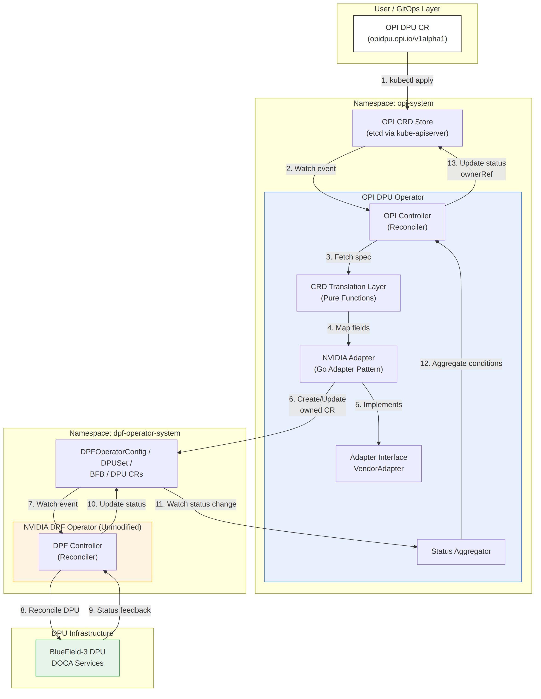
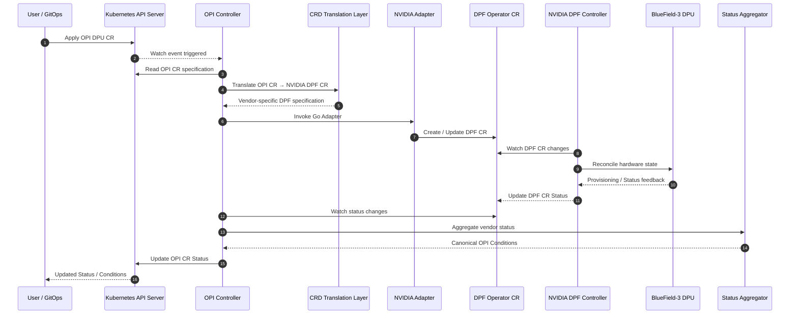
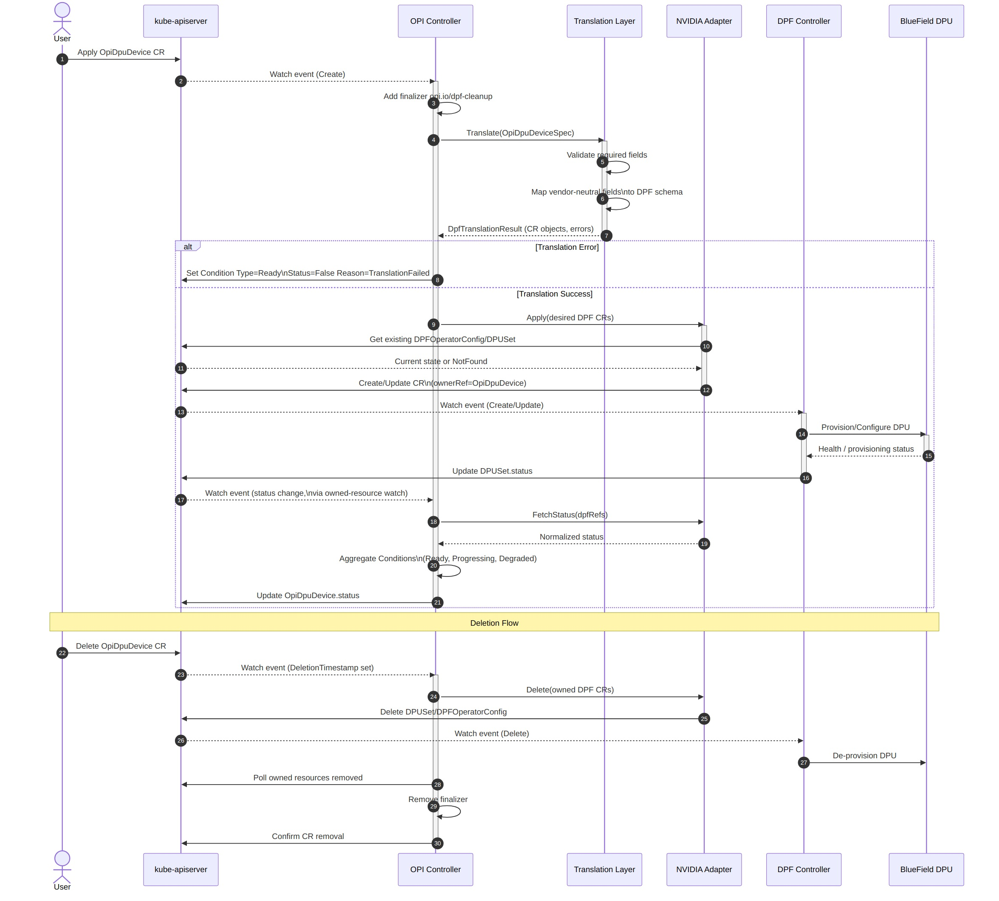
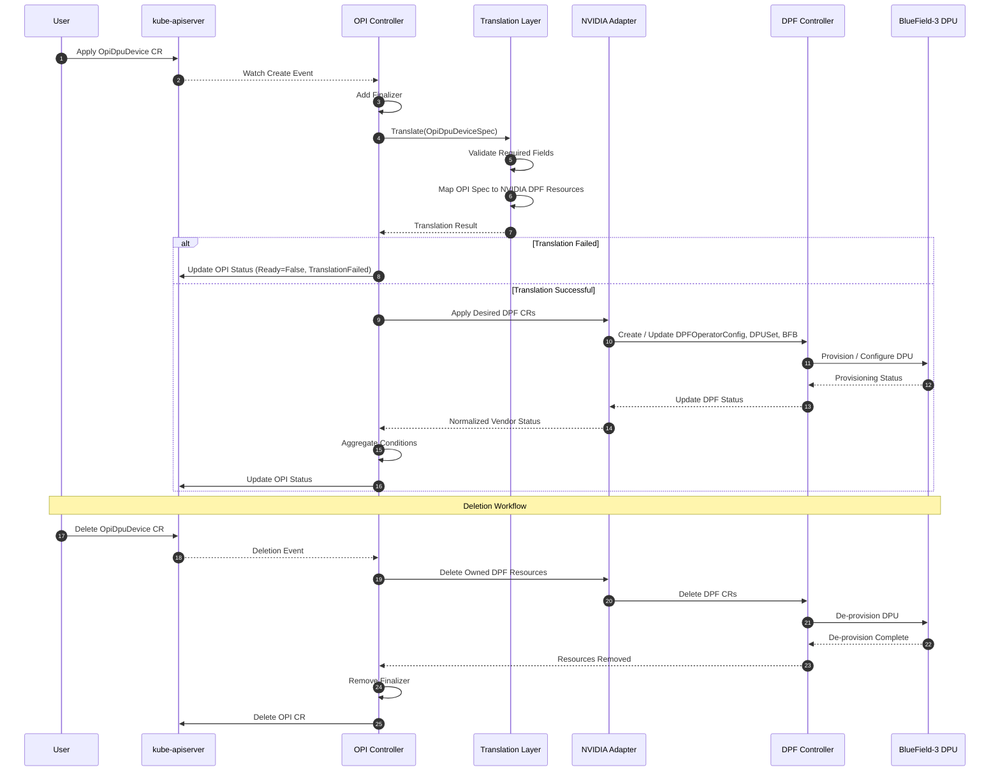
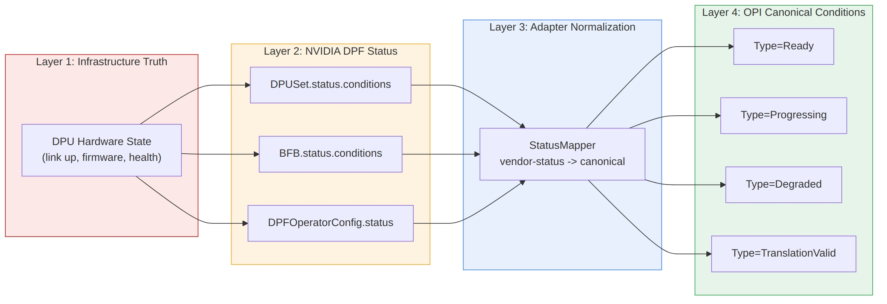
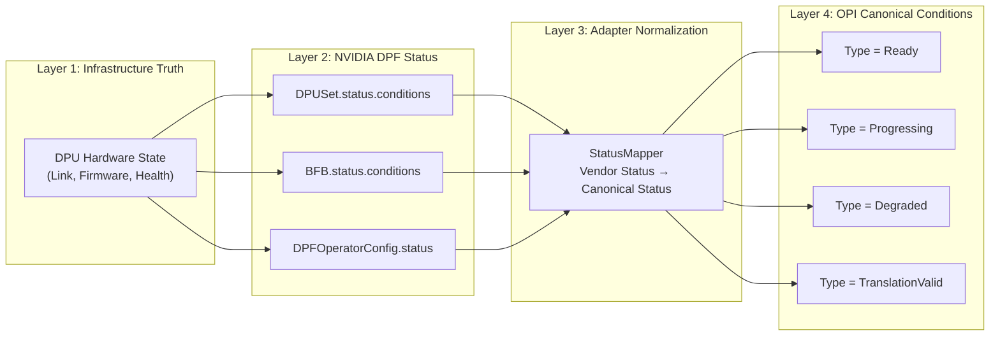

# OPI DPU Operator - NVIDIA DPF Integration Architecture

Hands-On Assignment 1: LLM-Assisted Architecture Design for OPI DPU Operator
Principal Cloud-Native Systems Architecture Review

*July 2026*

---

## Table of Contents

1. Purpose and Scope
2. Architectural Assumptions
   - 2.1 Namespace and Deployment Topology
   - 2.2 RBAC Model
   - 2.3 Reconciliation Boundaries
   - 2.4 Ownership Model
3. Component Breakdown
   - 3.1 High-Level Architecture
   - 3.2 Components
4. Reconciliation Workflow
   - 4.1 Sequence Diagram - Create, Status Sync, Delete
   - 4.2 Create / Update Path
   - 4.3 Deletion Path
   - 4.4 Idempotency and Concurrency Guarantees
5. Error Handling and Status Propagation
   - 5.1 Layered Status Model
   - 5.2 Canonical Condition Types
   - 5.3 Error Handling Taxonomy
   - 5.4 Observability
6. Trade-off Analysis
   - 6.1 Options Compared
   - 6.2 Why Not Sub-Operator Pattern Here
   - 6.3 Why Translation Layer Alone Is Insufficient
7. Scalability, Maintainability, Extensibility, Security
   - 7.1 Scalability
   - 7.2 Maintainability
   - 7.3 Extensibility
   - 7.4 Security
8. Recommendation

---
   # 1. Purpose and Scope

This document specifies a production-grade architecture for integrating NVIDIA DPF (DOCA Platform Framework) Operator support into the vendor-neutral OPI DPU Operator, without modifying, forking, or vendoring the NVIDIA DPF Operator codebase. The design uses a declarative CRD Translation Layer combined with a Go Adapter Pattern so that the OPI Operator remains the single source of reconciliation truth for the user, while NVIDIA DPF remains the single source of truth for BlueField DPU lifecycle management.

The design is evaluated against Kubernetes Operator best practices including:

- Single-responsibility reconciliation
- Explicit ownership
- Idempotency
- Level-triggered control loops
- Kubernetes-native status and condition reporting

---

# 2. Architectural Assumptions

*2.1 Namespace and Deployment Topology*

| Component | Namespace | Deployment Model |
|-----------|-----------|------------------|
| OPI DPU Operator (controller-manager) | `opi-system` | Deployment, leader-elected, 1 active replica (HA optional) |
| NVIDIA DPF Operator (unmodified upstream) | `dpf-operator-system` | Deployed exactly as published by NVIDIA (Helm chart / OLM bundle) |
| OPI CRDs (`OpiDpuDevice`, `OpiDpuNetworkFunction`, etc.) | Cluster-scoped CRD; namespaced CR instances in tenant namespaces | Installed by OPI Operator's CRD manifests |
| NVIDIA DPF CRDs (`DPFOperatorConfig`, `DPUSet`, `BFB`, `DPUFlavor`, `DPU`) | Cluster-scoped CRD; namespaced CR instances in `dpf-operator-system` | Installed by NVIDIA's own manifests — never modified | 

*Assumption A1* — Operator Isolation. The OPI Operator and the DPF Operator run as independent Deployments with independent RBAC, independent leader election locks, and independent CRD ownership. There is no shared binary, shared informer cache, or in-process function call between the two operators. All interaction happens exclusively through the Kubernetes API server (CR create/update/delete + watch), which is the only integration contract NVIDIA's operator guarantees to honor.

*Assumption A2* — DPF CRDs are an unstable/opaque vendor contract. The Translation Layer treats DPF CRD schemas as an external API contract. Version skew is handled via a Translator interface keyed by DPF API version (v1alpha1, v1beta1, …), not by forking DPF types.

*2.2 RBAC Model*
Principle of least privilege, split by operator:

```yaml
# OPI Operator ClusterRole (excerpt)
apiVersion: rbac.authorization.k8s.io/v1
kind: ClusterRole
metadata:
  name: opi-dpu-operator-role
rules:
  - apiGroups: ["opi.io"]
    resources: ["opidpudevices", "opidpudevices/status", "opidpudevices/finalizers"]
    verbs: ["get", "list", "watch", "update", "patch"]

  - apiGroups: ["provisioning.dpu.nvidia.com"]
    resources: ["dpfoperatorconfigs", "dpusets", "bfbs", "dpuflavors"]
    verbs: ["get", "list", "watch", "create", "update", "patch", "delete"]

  - apiGroups: ["provisioning.dpu.nvidia.com"]
    resources: ["dpfoperatorconfigs/status", "dpusets/status"]
    verbs: ["get", "list", "watch"] 

  - apiGroups: [""]
    resources: ["events"]
    verbs: ["create", "patch"]
  ```
  *Key rule*: the OPI Operator is granted write access only to the DPF spec subresources it must create/update, and read-only access to DPF status subresources — it must never mutate vendor-reported status, only read and re-project it. The DPF Operator's own ClusterRole is untouched and continues to be managed by NVIDIA's manifests.


*2.3 Reconciliation Boundaries*
1. OPI Controller reconciles OpiDpuDevice (and sibling OPI CRs) only. It never reconciles DPF CRDs directly in the sense of driving DPU hardware state machines; it only creates/updates DPF CRs and reads their status.

2. DPF Controller reconciles DPF CRDs only, exactly as it does today with zero awareness that OPI exists. This is the crux of "maximizing reuse without modification."

3. One-way spec ownership, two-way status flow: OPI → DPF spec is a one-directional push (OPI is the writer of desired state); DPF → OPI status is a one-directional pull (OPI watches and reads, never writes DPF status).


*2.4 Ownership Model*
Every DPF CR created by the Adapter carries:

```yaml
metadata:
  ownerReferences:
    - apiVersion: opi.io/v1alpha1
      kind: OpiDpuDevice
      name: <opi-cr-name>
      uid: <opi-cr-uid>
      controller: true
      blockOwnerDeletion: true
  labels:
    opi.io/managed-by: opi-dpu-operator
    opi.io/owner-name: <opi-cr-name>
    opi.io/owner-namespace: <opi-cr-namespace>
    opi.io/owner-uid: <opi-cr-uid>
```

1. ownerReferences enables native Kubernetes garbage collection as a safety net; the primary deletion path is still an explicit, finalizer-gated delete performed by the OPI controller (Section 4.3), because DPF CR deletion must be sequenced with DPU hardware de-provisioning before the OPI CR is allowed to disappear. Labels provide an O(1) reverse-index for the OPI controller's watch-based enqueue function, since ownerReferences alone cannot be used as a list/watch selector.

2. Cross-namespace ownership note: Kubernetes disallows ownerReferences across namespaces for namespaced owners. Because OpiDpuDevice (tenant namespace) and DPF CRs (dpf-operator-system) live in different namespaces, the label-based reverse index (opi.io/owner-uid) is the authoritative ownership link, and Kubernetes ownerReferences are set only when both objects share a namespace (cluster-scoped DPF CRs, if any, may still use ownerReferences directly). This distinction is called out explicitly because it is the single most common correctness bug in cross-operator adapter designs.

# 3. Component Breakdown   
*3.1 High-Level Architecture*


**Architecture Explanation**

- The proposed architecture follows a CRD Translation Layer + Go Adapter integration model to incorporate NVIDIA DPF support into the vendor-neutral OPI DPU Operator while maximizing reuse of the existing NVIDIA DPF Operator.

- The workflow begins when a user or GitOps pipeline creates an OPI Custom Resource (CR). The Kubernetes API Server notifies the OPI Controller through the standard watch mechanism. The controller reads the desired state and forwards the resource to the CRD Translation Layer, which converts the vendor-neutral OPI specification into NVIDIA-specific DPF Custom Resources.

- The translated resources are then passed to the NVIDIA Adapter, which performs server-side apply operations to create or update the required DPF resources in the Kubernetes cluster. The Adapter is the only component that understands NVIDIA-specific APIs, ensuring that vendor-specific logic remains isolated from the core OPI controller.

- The NVIDIA DPF Operator continuously watches these DPF resources and performs the actual provisioning and lifecycle management of the BlueField-3 DPU. As provisioning progresses, the DPF Operator updates the status of its resources.

- The OPI Controller monitors these status updates, retrieves the vendor-specific conditions through the Adapter, and forwards them to the Status Aggregator. The Status Aggregator converts vendor-specific status information into standardized OPI Conditions, allowing users to interact with a consistent vendor-neutral API regardless of the underlying hardware implementation.

- This architecture preserves Kubernetes Operator best practices by maintaining independent reconciliation loops, clear ownership boundaries, declarative desired-state management, and clean separation between vendor-neutral control logic and vendor-specific implementation details. The design also enables future support for additional vendors such as Intel, AMD, and Marvell by implementing new Translation Layer and Adapter modules without modifying the core OPI Controller.

*3.1 High-Level Architecture Workflow*


*3.2 Components*
*3.2.1 OPI CRD Layer (opi.io/v1alpha1)*
Vendor-neutral, hardware-agnostic API surface consumed by users/GitOps:
```yaml
apiVersion: opi.io/v1alpha1
kind: OpiDpuDevice
metadata:
  name: dpu-node-01
  namespace: tenant-a
spec:
  vendor: nvidia          # nvidia | marvel | intel | amd
  dpuSelector:
    nodeName: worker-03
  bfb:
    firmwareVersion: "4.4.0"
    imageURL: "https://.../bf-bundle.bfb"
  networking:
    mode: dpu-dpuOnly     # maps to DPF hostnetwork mode
    ovnBridge: br-opi
  resources:
    hugepages: "4Gi"
    vfCount: 8
status:
  phase: Provisioning
  conditions: [...]
  observedGeneration: 3
```
 This CRD never contains an NVIDIA-shaped field name. This is the enforcement mechanism for vendor-neutrality: any field named after an NVIDIA concept (e.g., dpuFlavor, bfb.raw) is a translation-layer detail, not a user-facing contract.

*3.2.2 OPI Controller (Reconciler)*
Standard controller-runtime Reconcile(ctx, req) loop. Responsibilities:
1. Fetch OpiDpuDevice; handle NotFound as no-op.
2. Handle finalizer lifecycle (add on create, process on delete).
3. Invoke Translation Layer to obtain desired DPF object set.
4. Invoke Adapter to reconcile (apply/patch) those objects against the API server.
5. Invoke Adapter's status reader; aggregate into OPI status Conditions.
6. Requeue with backoff on transient errors; requeue-after on Progressing.

The controller itself contains no vendor-specific code — it depends only on the VendorAdapter interface (3.2.4).

*3.2.3 CRD Translation Layer*
A pure, side-effect-free Go package (pkg/translate/nvidia) whose sole job is:
```go
Translate(spec OpiDpuDeviceSpec, ctx TranslationContext) (DPFResourceSet, []FieldError)
```

1. Pure functions: no API calls, no I/O — fully unit-testable with table-driven tests and no fake clients required.
2. DPFResourceSet is a typed bundle: { DPFOperatorConfig *v1alpha1.DPFOperatorConfig; DPUSet *v1alpha1.DPUSet; BFB *v1alpha1.BFB }.
3. FieldError captures per-field mapping failures (e.g., unsupported networking.mode enum value) so they can be surfaced as a single TranslationValid=False condition with actionable messages, rather than a generic reconcile error.
4. Versioned per DPF API version: translate/nvidia/v1alpha1, translate/nvidia/v1beta1, selected at runtime via a discovered/annotated DPF API version, so a DPF Operator upgrade does not require an OPI Operator code change beyond adding a new translator package.

*3.2.4 NVIDIA Adapter (Go Adapter Pattern)*
Implements the vendor-neutral interface the OPI Controller depends on:
```go
type VendorAdapter interface {
    Reconcile(ctx context.Context, owner *opiv1alpha1.OpiDpuDevice) (AdapterResult, error)
    FetchStatus(ctx context.Context, owner *opiv1alpha1.OpiDpuDevice) (NormalizedStatus, error)
    Delete(ctx context.Context, owner *opiv1alpha1.OpiDpuDevice) (bool /*fullyRemoved*/, error)
}
```
NvidiaDPFAdapter is the concrete implementation:
- Calls the Translation Layer to get desired objects.
- Performs server-side apply (client.Apply, field manager opi-dpu-operator) against dpf-operator-system, so the OPI Operator co-exists safely with any human or GitOps actor also touching DPF CRs, without clobbering fields it doesn't own.
- Implements StatusMapper (Section 5) to normalize DPF's native conditions into OPI's canonical condition vocabulary.
- Is the only package in the codebase permitted to import NVIDIA DPF's Go client types (github.com/nvidia/doca-platform/api/...). This import boundary is enforced via a lint rule / Go build tag, so vendor-specific dependencies cannot leak into the OPI core.

Adding a second vendor (Marvel, Intel IPU) means writing a new pkg/adapter/marvel package and a new pkg/translate/marvel package — zero changes to the OPI Controller, OPI CRD schema, or existing NVIDIA adapter.

*3.2.5 Status Aggregator*
Consumes NormalizedStatus from the active adapter(s) and produces the canonical Conditions array written to OpiDpuDevice.status (Section 5).

*3.2.6 NVIDIA DPF Operator (Unmodified)*
Treated as a black box. The only contract relied upon:
- It watches DPFOperatorConfig, DPUSet, BFB, DPUFlavor in its own namespace.
- It writes status.conditions (standard metav1.Condition) on those objects.
- It performs its own garbage collection of child resources when a DPUSet is deleted.

No PRs, patches, or custom builds of the DPF Operator are required.
---
# 4. Reconciliation Workflow
*4.1 Sequence Diagram — Create, Status Sync, Delete*


**Reconciliation Workflow Explanation**
- The reconciliation workflow begins when a user creates an `OpiDpuDevice` Custom Resource through the Kubernetes API Server. The OPI Controller receives the create event, adds a finalizer to ensure controlled cleanup, and invokes the CRD Translation Layer to convert the vendor-neutral OPI specification into NVIDIA-specific DPF resources.

- The Translation Layer first validates the incoming specification and maps all supported fields into the corresponding NVIDIA DPF Custom Resources. If validation fails, the reconciliation terminates immediately and the OPI Controller updates the Custom Resource status with a `TranslationFailed` condition, providing actionable error information without creating any vendor resources.

- If the translation succeeds, the NVIDIA Adapter creates or updates the required DPF Custom Resources. The existing NVIDIA DPF Controller reconciles these resources without any knowledge of the OPI Operator and performs the actual provisioning of the BlueField-3 DPU.

- As the provisioning process progresses, the DPF Controller continuously updates the status of its resources. The NVIDIA Adapter retrieves these vendor-specific status objects and converts them into a normalized representation. The OPI Controller aggregates these conditions into the standard OPI status model (such as **Ready**, **Progressing**, and **Degraded**) before updating the original `OpiDpuDevice` Custom Resource.

- During deletion, the OPI Controller first requests deletion of all owned NVIDIA DPF resources through the Adapter. After the NVIDIA DPF Controller completes hardware de-provisioning and all dependent resources are removed, the OPI Controller removes its finalizer, allowing Kubernetes to safely delete the original OPI Custom Resource. This guarantees deterministic cleanup while maintaining clear ownership boundaries between the vendor-neutral OPI Operator and the vendor-specific NVIDIA DPF Operator.

*4.1 Reconciliation Workflow – Create, Status Synchronization, and Delete*



*4.2 Create / Update Path*

1. Admission: OpiDpuDevice is validated by a ValidatingAdmissionWebhook (structural + semantic checks, e.g., enum values) before it ever reaches the controller — fail fast, outside the reconcile loop.
2. Enqueue: controller-runtime's default watch on OpiDpuDevice, plus a secondary watch on DPF CR types filtered by the opi.io/owner-uid label, using handler.EnqueueRequestsFromMapFunc to map a DPF CR event back to the owning OPI CR's reconcile Request. This is what makes the loop level-triggered and reactive to vendor-side status changes, not just to OPI CR edits.
3. Finalizer: on first reconcile, if DeletionTimestamp is nil and finalizer opi.io/dpf-cleanup absent, add it and return (re-triggers reconcile).
4. Translate: desired-state DPF objects computed deterministically from spec + observedGeneration.
5. Apply: Adapter performs server-side apply per DPF object. Apply is idempotent — re-running with unchanged spec is a no-op API call (empty patch).
6. Update path specifics: a spec change bumps metadata.generation; the controller re-translates and re-applies only the changed fields via SSA, so unrelated fields owned by other field managers (if any) are preserved.
7. Status read-back: Adapter reads status.conditions from the DPF objects it owns, maps to NormalizedStatus.
8. Status write: OPI Controller patches OpiDpuDevice.status (a separate API call via the /status subresource, never combined with spec updates) and sets status.observedGeneration = metadata.generation once translation+apply succeeded, signaling the spec has been fully processed.


*4.3 Deletion Path*

1. kubectl delete opidpudevice sets DeletionTimestamp; object persists because of the finalizer.
2. Controller detects DeletionTimestamp != nil, enters cleanup branch.
3. Adapter issues Delete on owned DPF CRs (DPUSet first, then BFB/DPFOperatorConfig if not shared by other OpiDpuDevice instances — reference-counted via the label index to avoid deleting a shared BFB still in use by a sibling CR).
4. DPF Operator performs its native de-provisioning of the physical DPU (firmware reset / BFB rollback / VF teardown) — entirely inside NVIDIA's own reconciler, untouched by OPI.
5. OPI Controller polls (via the secondary watch, not a busy-loop) until the owned DPF objects are fully absent from the API server.
6. Controller removes the finalizer; API server completes the OpiDpuDevice deletion.

This finalizer-gated sequencing guarantees the OPI CR — the object the user is watching — never disappears while a physical DPU is mid-teardown, which is the correctness property a naive ownerReferences-only cascade cannot provide (cascading GC is asynchronous and best-effort, with no confirmation hook).

*4.4 Idempotency and Concurrency Guarantees*

- All apply operations are server-side apply, making retries after a crash-mid-reconcile safe.
- The reconciler is level-triggered: it recomputes full desired state from current spec every invocation rather than accumulating deltas, so a missed or duplicated event never causes drift.
- Optimistic concurrency: every update uses resourceVersion-checked writes; Conflict errors trigger an immediate requeue rather than an error surfaced to the user.
---

# 5.Error Handling and Status Propagation

*5.1 Layered Status Model*


*Layered Status Propagation Explanation*

- The proposed status propagation architecture transforms low-level hardware information into standardized OPI conditions through a four-layer pipeline.

- **Layer 1** represents the physical infrastructure state collected from the BlueField-3 DPU, including hardware health, firmware state, link status, and operational telemetry.

- **Layer 2** consists of the vendor-specific status resources maintained by the NVIDIA DPF Operator. Components such as `DPUSet`, `BFB`, and `DPFOperatorConfig` expose detailed provisioning and runtime conditions that accurately represent the current state of the hardware.

- **Layer 3** introduces a Status Mapper within the NVIDIA Adapter. This component normalizes the heterogeneous vendor-specific status objects into a consistent internal representation. By isolating vendor-specific logic inside the Adapter, the core OPI Operator remains completely vendor-neutral.

- **Layer 4** converts the normalized status into the canonical OPI condition model. The resulting conditions include **Ready**, **Progressing**, **Degraded**, and **TranslationValid**, providing users with a stable and implementation-independent status interface regardless of the underlying DPU vendor.

This layered architecture maintains clear separation of responsibilities, simplifies future support for additional vendors, and ensures that changes to NVIDIA-specific status schemas do not require modifications to the core OPI Operator reconciliation logic.

*5.1 Layered Status Propagation*


DPU hardware truth flows up through three normalization layers before reaching the user-facing OpiDpuDevice.status. This layering is what lets OPI stay vendor-neutral: layer 4 conditions have identical semantics regardless of which vendor adapter produced them.

*5.2 Canonical Condition Types*

| Condition Type | Meaning | Set By |
|----------------|---------|--------|
| `TranslationValid` | The OPI Custom Resource was successfully translated into vendor-specific DPF Custom Resources without validation or mapping errors. | Translation Layer |
| `Progressing` | The NVIDIA DPF Operator is actively provisioning, configuring, or updating the DPU resources. | Status Aggregator (derived from DPF `Progressing` / `Reconciling` conditions) |
| `Degraded` | A recoverable or non-terminal error has been reported by the vendor stack, such as firmware mismatch, provisioning failure, or retryable hardware issue. | Status Aggregator (derived from DPF `Degraded` or vendor error conditions) |
| `Ready` | The BlueField-3 DPU has been successfully provisioned and all required services are healthy and operational. | Status Aggregator (derived from DPF `Ready` / `Available` conditions) |

Each condition follows the standard metav1.Condition shape (type, status, reason, message, lastTransitionTime, observedGeneration), per Kubernetes API conventions — this is non-negotiable for kubectl wait, kstatus, and GitOps health-check compatibility (Argo CD, Flux).

*5.3 Error Handling Taxonomy*

| Error Class | Example | Handling Strategy |
|-------------|---------|-------------------|
| **Validation Error (Fail Fast)** | Invalid enum value in `spec.networking.mode` | Rejected by the admission webhook before reconciliation begins. No partial resources are created, and the user receives immediate validation feedback. |
| **Translation Error (Deterministic, Non-Retryable)** | Field combination unsupported by the installed NVIDIA DPF API version | Set `TranslationValid=False` with the reason `UnsupportedFieldCombination`. The controller does not retry until the user updates the specification. |
| **Transient API Error** | Kubernetes API conflicts, `Conflict`, or `ServerTimeout` responses | Apply the standard controller-runtime exponential backoff mechanism. No condition changes are required unless the error persists. |
| **Vendor Provisioning Error (Retryable)** | Temporary BFB flashing failure reported by the NVIDIA DPF Operator | Set `Degraded=True` with reason `FirmwareFlashFailed`, retain `Progressing=True`, and automatically retry reconciliation after the controller backoff interval. |
| **Vendor Terminal Error** | Irrecoverable BlueField hardware failure reported by the DPF Operator | Set `Ready=False` and `Degraded=True` with reason `HardwareFault`. Emit Kubernetes warning events, stop active reconciliation, and wait for user intervention or hardware replacement. |
| **Partial Deletion Failure** | DPF resources remain in the `Terminating` state because of vendor-owned finalizers | Keep the OPI finalizer until all owned DPF resources are removed. Set `Ready=Unknown` with reason `DeletionPending` and surface the status so operators can safely intervene if required. |

*Error Handling Strategy*
1. The proposed architecture classifies reconciliation failures into six categories based on whether they are recoverable, deterministic, or infrastructure-related. Validation and translation errors are treated as fail-fast conditions because they originate from invalid user input or unsupported API combinations and therefore should not trigger automatic retries.

2. Transient Kubernetes API failures are handled using the standard controller-runtime retry mechanism, ensuring that temporary communication issues do not unnecessarily modify the resource status. Vendor provisioning failures are considered recoverable and therefore keep the resource in a progressing state while allowing reconciliation to continue automatically.

3. Irrecoverable hardware failures immediately transition the resource into a degraded state and require manual intervention. During deletion, the controller preserves the OPI finalizer until all dependent NVIDIA DPF resources have been successfully removed, guaranteeing deterministic cleanup and preventing orphaned infrastructure resources.

*5.4 Observability*

- Every state transition emits a Kubernetes Event (Normal/Warning) in addition to the Condition update, for kubectl describe visibility.
- Structured logs carry opi.name, opi.namespace, dpf.kind, dpf.name, translation.version fields for correlation.
- Prometheus metrics:opi_reconcile_duration_seconds, opi_translation_errors_total{reason}, opi_dpf_status_lag_seconds (time between DPF status change and OPI status reflecting it) — the last metric directly measures adapter-layer overhead.
---

# 6.Trade-off Analysis
*6.1 Options Compared*

| Criterion | CRD Translation Layer (alone) | Go Adapter Pattern (alone) | Sub-Operator Pattern | **Proposed: Translation Layer + Adapter** |
|-----------|-------------------------------|----------------------------|----------------------|-------------------------------------------|
| **Definition** | Converts OPI CRs into NVIDIA DPF CRs through field mapping. | Vendor-specific Go interface encapsulating mapping and API operations. | Separate Kubernetes controller responsible for vendor resources. | Combines pure CRD translation with a vendor-specific Go Adapter for applying resources and normalizing status. |
| **Coupling to NVIDIA Internals** | Low for field mapping but lacks API abstraction and status normalization. | Medium because vendor APIs remain inside the adapter implementation. | Low coupling but duplicates reconciliation infrastructure. | **Low.** Vendor-specific logic is isolated behind a well-defined adapter interface. |
| **Testability** | Excellent for mapping logic but cannot test resource application. | Moderate because fake Kubernetes clients are required. | Moderate to Low due to multiple controllers. | **High.** Translation layer is unit-testable while adapter logic can be tested independently using mocked interfaces. |
| **Extensibility (New Vendor)** | Requires implementing new mapping logic and status conversion. | Requires a new adapter implementation for each vendor. | Requires a completely new controller for every vendor. | **Excellent.** Only a new translation package and adapter implementation are required. |
| **Operational Overhead** | Low but requires another component to apply resources. | Single controller with minimal operational complexity. | Highest operational overhead due to multiple controllers and RBAC objects. | **Low.** Maintains a single controller-manager with plugin-like vendor adapters. |
| **Failure Isolation** | Limited because translation alone cannot isolate runtime failures. | Runtime failures remain inside the adapter implementation. | Strong isolation since each vendor controller runs independently. | **Good.** Adapter failures remain isolated while the core controller continues operating. |
| **Resource Footprint** | Minimal. | Minimal. | Highest because multiple controller deployments are required. | **Minimal.** Single binary with shared infrastructure and lightweight adapters. |
| **Time-to-Market** | Fast for mapping only. | Fast. | Slow because a complete controller must be implemented. | **Fastest overall.** Reuses the existing OPI Operator while leveraging the upstream NVIDIA DPF Operator. |
| **Best Fit** | Suitable when only field translation is required. | Suitable for a single vendor implementation. | Suitable only when complete vendor isolation is mandatory. | **Recommended approach.** Balances extensibility, maintainability, operational simplicity, and vendor neutrality. |

*Trade-off Analysis*
- The proposed **CRD Translation Layer + Go Adapter** architecture provides the best balance between extensibility, maintainability, and operational simplicity. A pure translation layer is highly testable but cannot manage vendor-specific API interactions or normalize runtime status. Conversely, a standalone Go Adapter encapsulates vendor APIs but lacks a clean separation between translation logic and reconciliation behavior.

- A Sub-Operator architecture offers the strongest isolation because each vendor operates its own independent controller. However, this comes at the cost of duplicated reconciliation loops, additional RBAC configuration, higher operational overhead, and more complex lifecycle management.

- By combining a pure Translation Layer with a Go Adapter, the proposed architecture preserves the vendor-neutral design goals of the OPI project while maximizing reuse of the existing NVIDIA DPF Operator. Translation logic remains deterministic and independently testable, vendor-specific behavior is isolated behind a stable adapter interface, and future vendors can be supported by implementing additional translation packages and adapters without modifying the core OPI Controller.

*6.2 Why Not Sub-Operator Pattern Here*

The Sub-Operator Pattern is architecturally clean but economically expensive for OPI's stated goal of maximizing reuse while minimizing operational surface: it would require OPI to ship, RBAC-provision, version, and upgrade an entire independent controller-manager per silicon vendor, each with its own leader-election lease, its own crash/restart lifecycle, and its own CRD-watch cache — multiplying cluster resource consumption and upgrade coordination burden linearly with vendor count. It is the right choice only if vendor reconciliation loops have genuinely incompatible operational requirements (e.g., different security boundaries requiring separate service accounts running in separate namespaces with no shared process) — which is not the case here, since the actual DPU provisioning work is fully delegated to NVIDIA's own DPF Operator regardless of pattern choice.

*6.3 Why Translation Layer Alone Is Insufficient*

A pure translation layer with no adapter has nowhere to put status normalization or apply semantics (server-side apply, conflict handling, reference counting for shared BFB/DPUSet objects) — these are stateful, API-interacting concerns that don't belong in a pure-function package. Pairing translation with an adapter cleanly separates "what should the DPF CR look like" (pure, deterministic, unit-testable) from "how do I safely reconcile that against a live cluster and read its status back" (side-effecting, requiring fakes/envtest).

---
# 7. Scalability, Maintainability, Extensibility, Security

*7.1 Scalability*
- Horizontal: OPI Controller shards work naturally across OpiDpuDevice objects via controller-runtime's workqueue; supports --max-concurrent-reconciles tuning independent of DPF Operator's own concurrency settings.
- Watch efficiency: the secondary watch on DPF CR types is label-selector filtered, avoiding a full-namespace watch fan-out as DPU/tenant count grows into the hundreds.
- API server load: server-side apply reduces payload size and avoids read-modify-write races that would otherwise multiply API calls under concurrent reconciles.
- DPF Operator is unaffected: since it is unmodified, its own scaling characteristics (tested and tuned by NVIDIA) are inherited as-is.


*7.2 Maintainability*
- Translation logic is versioned and isolated (translate/nvidia/v1alpha1 vs v1beta1), so a DPF schema bump is an additive package, not a rewrite.
- The VendorAdapter interface is the only contract the core controller depends on — changes inside the NVIDIA adapter cannot break the Marvel/Intel adapters or the controller itself.
- CI enforces an import boundary (e.g., depguard lint rule) preventing NVIDIA-specific types from leaking outside pkg/adapter/nvidia and pkg/translate/nvidia.


*7.3 Extensibility*
- New vendor = new translate/<vendor> + adapter/<vendor> packages, registered in an adapter factory keyed by spec.vendor. No CRD schema break, no controller rewrite.
- Multi-vendor clusters are supported natively: two OpiDpuDevice CRs with spec.vendor: nvidia and spec.vendor: marvel reconcile through the same controller, dispatched to different adapters.


*7.4 Security*
- RBAC least privilege (Section 2.2): OPI Operator cannot write DPF status subresources, cannot touch DPF Operator's own ServiceAccount or ClusterRoleBindings.
- Namespace isolation: DPF Operator's ServiceAccount and Secrets remain scoped to dpf-operator-system; the OPI Operator does not require a ServiceAccount in that namespace beyond the CR-management permissions above.
S- upply chain: NVIDIA DPF Operator image/manifests are consumed as-is from NVIDIA's signed distribution channel (Helm chart / OLM bundle with cosign verification), never rebuilt or repackaged by the OPI project — preserving NVIDIA's attestation chain.
- Admission control: the validating webhook (Section 4.2) prevents malformed or malicious field values (e.g., path traversal in bfb.imageURL) from ever reaching the translation layer.
- No privilege escalation path: because the OPI Operator only creates DPF spec objects and never directly touches the DPU dataplane or DPF's own credentials/secrets, a compromised OPI Operator is limited to the blast radius of "can request DPU provisioning," not "can bypass DPF's own validation."
---

# 8. Recommendation

The CRD Translation Layer + Go Adapter Pattern is the recommended architecture for the OPI DPU Operator's NVIDIA DPF integration because it is the only option among those evaluated that simultaneously satisfies all four of OPI's stated design constraints:

1. **Zero modification of the NVIDIA DPF Operator —**achieved by every option, but only the Translation Layer + Adapter approach achieves it without the operational multiplication cost of the Sub-Operator Pattern.
2. **Vendor-neutral CRD surface for users —** the OPI CRD schema contains no NVIDIA-specific vocabulary; the Adapter is the sole boundary where vendor semantics are introduced, keeping the user contract stable even if NVIDIA's DPF API changes.
3. **Clean testability and separation of concerns —**pure-function translation is table-test-friendly; adapter logic is envtest-friendly; the Sub-Operator alternative would require full multi-controller integration test harnesses to achieve comparable confidence.
4. **Low operational and resource overhead —** a single controller-manager process, single leader-election lease, single RBAC surface, and a shared informer cache scale to additional vendors as additive code, not additive infrastructure — directly serving OPI's mission of being a lightweight, vendor-neutral abstraction rather than a federation of vendor-specific operators.

This design should be adopted as the reference pattern for all future silicon-vendor integrations (Marvel OCTEON, Intel IPU, AMD Pensando) under the OPI DPU Operator project.