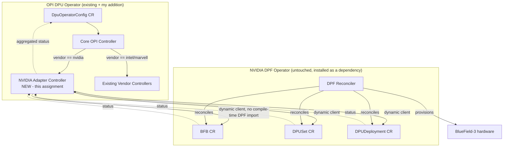
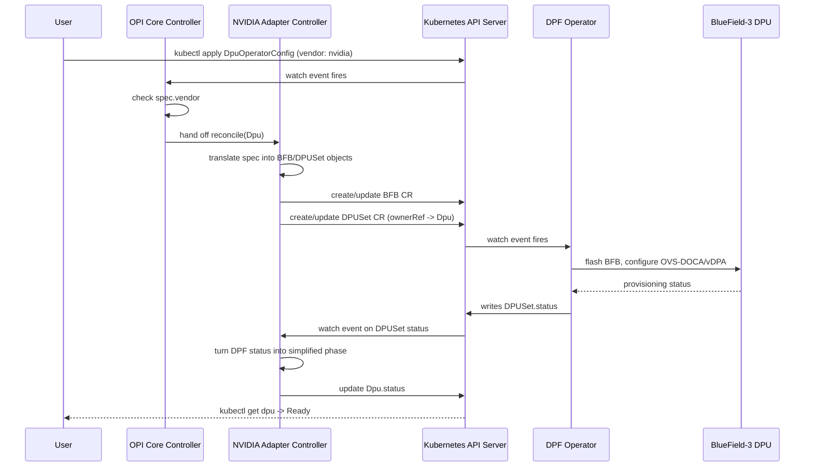
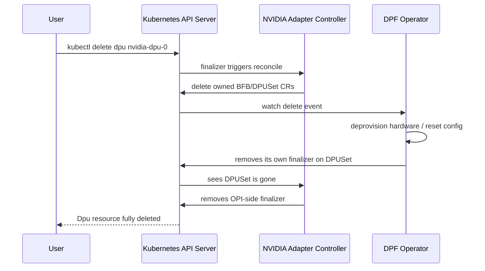

# Architecture Design: Adding NVIDIA DPU Support to the OPI DPU Operator

**LLM-Assisted Architecture Design**  
**Author:** Vimla Choudhary

## 1. What I'm actually trying to solve

Right now the OPI DPU operator only knows how to reconcile Intel and
Marvell DPUs. NVIDIA has BlueField-3, but they already ship their own
operator for it - DPF (DOCA Platform Framework) - which does the actual
BFB flashing and DOCA/OVS-offload config. So the real question isn't "how
do we support NVIDIA DPUs from scratch," it's how do we make OPI aware of
the hardware without re-writing everything DPF already does.

I didn't want to just port DPF's logic into OPI - every DOCA release would
then force an OPI release too, and that's a maintenance headache I'd
rather not sign up for. So the goal I set myself: reuse DPF as-is,
unmodified, and just build a translation layer on top.

## 2. How I used the LLM here

I used Claude to help me think through the integration patterns and sanity
check the sequence diagrams before I committed to one design (full prompts
in `llm_transcript.json`). I went in already knowing I wanted something
adapter-ish based on how OPI already splits by vendor, but I wanted a second
opinion on whether a pure in-process adapter vs. a CRD-translation
sub-controller was the better call, since I hadn't actually built a
sub-operator before.

## 3. Current state (what exists today)

- **OPI DPU Operator**: has one main CRD, `DpuOperatorConfig`, plus a
  per-node `Dpu` resource. The controller branches on `spec.vendor` and
  calls into vendor-specific daemons for Intel/Marvell.
- **NVIDIA DPF Operator**: totally separate operator, own CRDs - `BFB`,
  `DPUSet`, `DPUDeployment`, `DPUServiceChain`. It has zero awareness that
  OPI exists.
- There's currently no bridge between the two at all.

## 4. Options I considered

| Option | What it means | Why / why not |
|---|---|---|
| A. Reimplement DPF's logic natively in OPI | Copy the reconciliation logic for BFB flashing, DOCA config, etc. straight into OPI's controller | Ruled out fast - this means OPI has to chase every DOCA/firmware update NVIDIA makes, forever. Too much duplicated maintenance for basically no benefit. |
| B. In-process adapter that imports DPF's Go client directly | OPI controller calls into DPF's actual Go packages | Tempting because "no new CRDs," but it locks OPI's go.mod to DPF's release cadence, and if DPF's client panics it takes down the OPI controller process with it (same binary). |
| C. Sub-operator + CRD translation layer (**went with this**) | A small new controller inside OPI watches OPI's `Dpu` CR, and when vendor == nvidia it creates/updates the DPF CRDs (`BFB`, `DPUSet`) using the **unstructured/dynamic client** - no compile-time dependency on DPF's Go module at all | Loosest coupling, DPF stays 100% unmodified, OPI and DPF can be upgraded on separate schedules. This is basically the same pattern Cluster API uses for its infra providers, which is what convinced me it's a sane, "already proven" approach and not something I was making up. |

I went with C. The main trade-off I'm accepting is one extra reconcile hop
before status shows up on the OPI side - for provisioning workflows that
take minutes anyway (not milliseconds), that doesn't really matter.

## 5. The design



The adapter controller is the only new piece. It:
- reads `Dpu` resources where `spec.vendor: nvidia`
- builds the corresponding `BFB` and `DPUSet` objects as
  `unstructured.Unstructured` (so I never have to `go get` DPF's actual
  module - I just need to know the GVKs and field names)
- sets an owner reference from the DPF objects back to the OPI `Dpu`
  resource so deleting the `Dpu` garbage-collects the DPF side too
- watches DPF's status fields and copies a simplified phase
  (Pending/Provisioning/Ready/Failed) back onto the OPI resource

All the NVIDIA-specific knowledge (BFB version strings, DOCA profile names)
lives inside the translation functions in the adapter - the core OPI
reconciler doesn't need to know anything NVIDIA-specific, same as it
doesn't know Intel/Marvell-specific stuff today.

## 6. CRD shape on the OPI side (additive only, nothing removed)

```yaml
apiVersion: opi.opiproject.org/v1alpha1
kind: DpuOperatorConfig
spec:
  vendor: nvidia
  nvidia:
    bfbVersion: "24.10"
    docaProfile: "doca-ovs-offload"
    dpuSetSelector:
      matchLabels:
        node-role.kubernetes.io/dpu-worker: "true"
status:
  phase: Provisioning
  dpfRef:
    kind: DPUSet
    name: nvidia-dpuset-0
```

Nothing changes on the DPF CRDs - I'm not touching DPF at all, just reading
and writing to it through the API server.

## 7. Sequence diagram - creation/provisioning



## 8. Sequence diagram - deletion/cleanup



I added the finalizer dance mostly because I ran into this exact problem in
my LFX mentorship work with the OVS/DPU stack - if you don't wait for the
underlying hardware teardown before letting Kubernetes GC the CR, you end up
with orphaned state on the DPU that nothing cleans up.

## 9. Trade-offs, honestly

| Concern | My approach (C) | Option A | Option B |
|---|---|---|---|
| Ongoing maintenance | Low - DPF team owns the hard part | High - chasing every DOCA release | Medium - still tied to DPF's go.mod version |
| Coupling | Loose, API-only | None (fully duplicated logic) | Tight (shared binary) |
| Extra latency | One extra reconcile hop | None | None |
| Upgrade independently? | Yes | No | Mostly no |
| Blast radius if other side breaks | Contained to my controller | N/A | DPF client panic can take down OPI's process |
| Speed to build | Fast, thin layer | Slow, basically a rewrite | Medium |

Honestly the biggest risk with C: if NVIDIA changes DPF's CRD field names
between DOCA releases, my translation layer breaks silently until someone
notices status just stops updating. Would want a small conformance test in
CI that applies a `Dpu` against a pinned DPF CRD version and checks the
translated object actually has the fields DPF expects for that - didn't
have time to build it for this assignment, but it's the obvious next
step.

## 10. Rollout, if this were real

1. Ship the adapter controller behind a feature flag in the OPI operator
   manager, so it doesn't affect existing Intel/Marvell users at all.
2. Add DPF operator as a Helm dependency (installed, not forked).
3. Write e2e tests in kind/k3s with DPF's CRDs installed and a fake BFB
   controller, since I don't have real BlueField hardware to test against.
4. Document the OPI-field -> DPF-field mapping as the actual contract to
   keep stable - that mapping is really the whole point of this design.