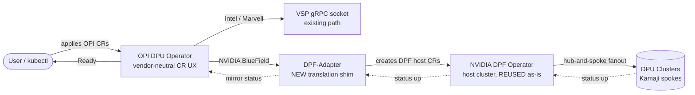
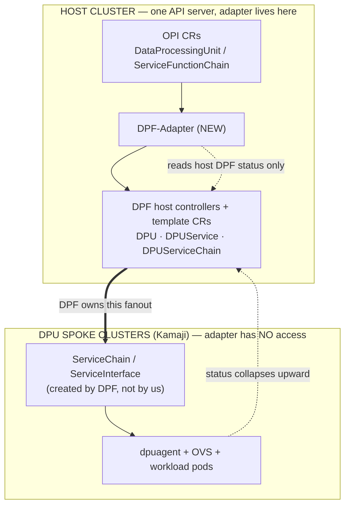
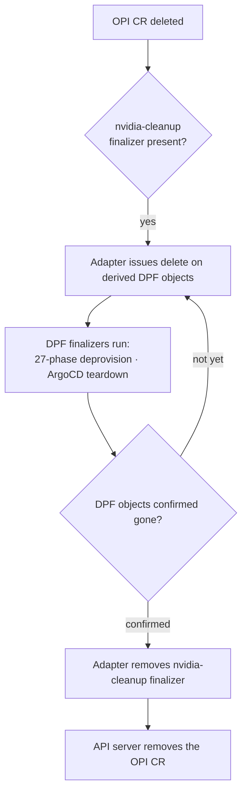
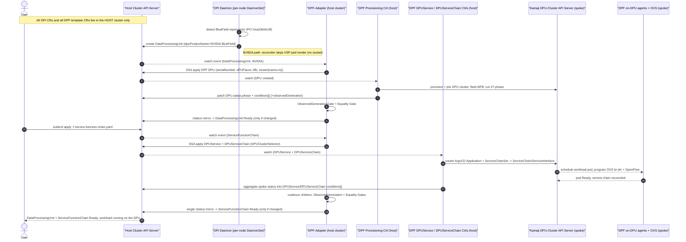
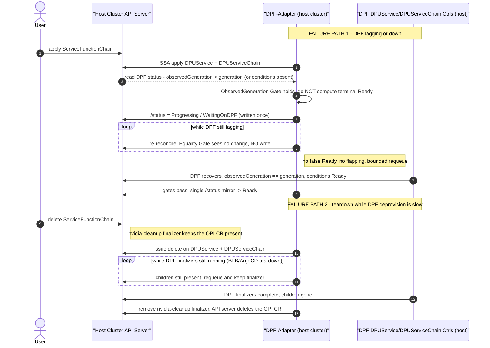
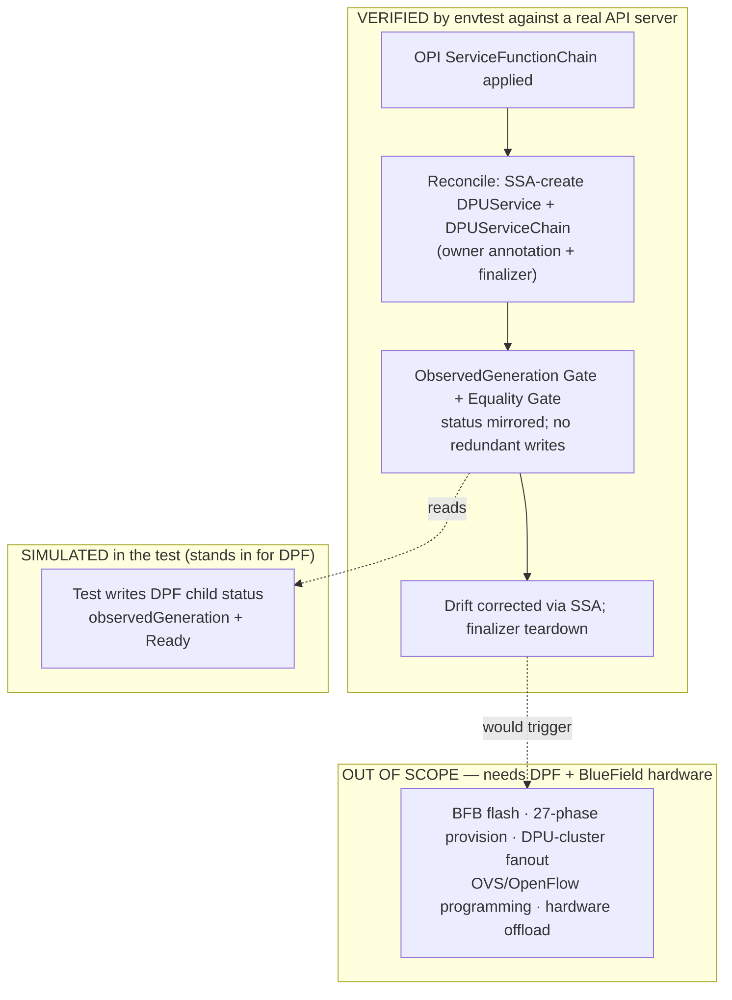
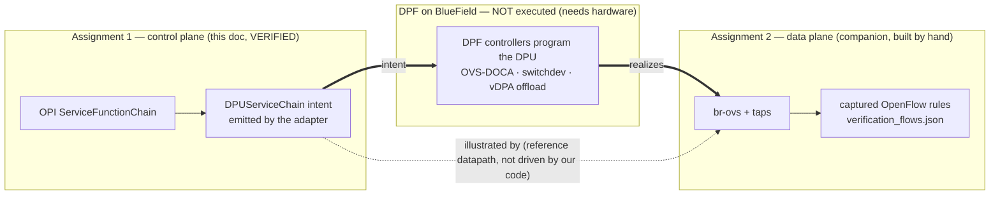

# Architecture Design: NVIDIA BlueField Support in the OPI DPU Operator

**Author:** Yash Pratap Singh
**Assignment:** OPI Internship — Hands-On Assignment 2

**Pattern:** Host-Cluster Symmetric Shim (Pattern 1) — an out-of-tree `DPF-Adapter` that translates OPI CRs into NVIDIA DPF host-cluster CRs and lets DPF do the rest.

**Basis:** `openshift/dpu-operator` @ `3092bcbe`; NVIDIA DOCA Platform Framework (DPF) per the accompanying review. DPF field names not confirmed against raw source are flagged as validation boundaries (§5.2).

---

## At a glance (Overview)

- **Goal:** let a user manage an NVIDIA BlueField DPU through OPI's existing CR UX — the *same* experience as Intel and Marvell — without reimplementing anything DPF already does.
- **How:** add **one** new controller, the **`DPF-Adapter`**, in the host cluster. It watches OPI CRs and *translates* them into DPF's host CRs. DPF's own operator then provisions the hardware and pushes work to the DPU clusters.
- **What we reuse (not rebuild):** DPU provisioning, BFB flashing, the 27-phase lifecycle, hub-and-spoke fanout to DPU clusters, OVS/OpenFlow programming, and ArgoCD/Helm delivery — **all of it stays inside DPF, untouched.**
- **What we add:** a thin translation + status-mirroring layer, and two small guards on OPI's existing node daemon.
- **What we deliberately do *not* do:** we do not touch the DPU spoke clusters, hold their credentials, or reimplement DPF's orchestration.

---

## 1. Architecture: responsibilities, boundary, and why this pattern

### 1.1 What OPI owns

- **A vendor-neutral CR surface.** OPI exposes `DataProcessingUnit` (one per physical DPU, cluster-scoped) and `ServiceFunctionChain` (a workload to run on the DPU) — the user-facing contract we want NVIDIA to honor.
- **Per-node hardware detection.** OPI's DaemonSet runs a 1-second detect loop (`internal/daemon/daemon.go`) that PCI-detects DPUs and publishes a `DataProcessingUnit` CR. Adding NVIDIA here is a new `VendorDetector` (`bluefield.go`) matching BlueField PCI IDs `0xa2d6/0xa2dc/0xa2df`.
- **The existing Intel/Marvell driver seam.** For those vendors, OPI dispatches a vendor VSP pod that speaks gRPC over a Unix socket (`dpu-api/api.proto`). This seam does **not** extend to NVIDIA (see §1.4).

### 1.2 What DPF owns — and therefore what we reuse instead of rebuild

- **DPU provisioning and lifecycle:** the `DPU` CR's 27-phase state machine, BFB boot-image flashing, firmware config.
- **DPU-cluster orchestration:** standing up Kubernetes control planes on the DPUs via Kamaji/static managers (`DPUCluster`).
- **Hub-and-spoke fanout:** host-side template CRs (`DPUService`, `DPUServiceChain`) that DPF expands *into each DPU cluster* via a `DPUClusterSelector`.
- **Hardware data-path programming:** OVS bridges (`br-sfc`, `br-ovn`) and OpenFlow rules, done inside DPF's Go controllers (never shelled out).
- **Workload delivery:** `DPUService` → ArgoCD `Application` → Helm chart onto the DPU cluster.

> **Reuse callout:** every bullet above is capability the OPI operator would otherwise have to build from scratch. Pattern 1's entire justification is that it consumes all of it as a black box.

### 1.3 The integration boundary

The single most important design decision is *where the seam sits*: the adapter operates against **one API server (the host cluster) and nothing else.**

- The adapter creates only DPF's **host-cluster** template CRs (`DPU`, `DPUService`, `DPUServiceChain`).
- DPF — not the adapter — reaches into the Kamaji DPU spoke clusters and creates the per-node primitives (`ServiceChain`, `ServiceInterface`) there.
- The adapter therefore needs **zero** credentials, network routes, or visibility into the spokes.

- **Why the seam is drawn here:** it reconciles the topology mismatch instead of fighting it. OPI is natively *symmetric* (same CRs on host and DPU-side clusters); DPF is natively *hub-and-spoke* (one host cluster driving N spokes). Pattern 1 concedes the NVIDIA data path to DPF's hub-and-spoke model and simply does not deploy an OPI operator into the NVIDIA DPU cluster — DPF's `dpuagent` occupies that role. This is a deliberate, documented asymmetry for the NVIDIA vendor path, not an oversight.

> **Reuse callout:** by translating `ServiceFunctionChain` into DPF's `DPUServiceChain` (a *host* template) rather than into raw spoke-side `ServiceChain`, we let DPF's fanout do the multi-cluster work — which is exactly why the credential surface stays confined to the host cluster.

### 1.4 Why Pattern 1 (and not the alternatives)

- **Pattern 1 — Host shim (chosen):** all reconciliation host-local; DPF reused whole; smallest blast radius; tightest RBAC; most idiomatic controller composition; smallest, most natural extension of OPI's existing "CR in → reconciler reacts" flow.
- **Pattern 2 — Split-plane multi-cluster (documented alternative):** the adapter would talk *directly* to each DPU spoke to drive `ServiceChain`/`ServiceInterface`. It buys finer control but requires N per-spoke Kamaji credentials, token rotation, and multi-cluster caches — and it introduces a genuine split-brain hazard when a spoke control plane partitions (two writers to `ServiceChain`). Justified only if a future need demands per-primitive control that DPF's host templates cannot express.
- **Pattern 3 — In-process vendor plugin (rejected):** vendoring DPF's libraries into the OPI daemon. Rejected because DPF is explicitly *not* built as a library; it drags DPF's entire dependency graph into OPI's binary (MVS version conflicts, runtime panics, no crash isolation, fused release cadence), and it reuses only libraries while throwing away DPF's orchestration — the opposite of the assignment's goal.
- **Why not the OPI VSP-gRPC seam for NVIDIA:** OPI's Intel/Marvell driver seam is a generic gRPC socket, but **DPF exposes no equivalent** — its gRPC boundary is storage-only, and all networking/provisioning happens inside DPF's controllers. There is nothing on the NVIDIA side for a VSP socket to talk to, so this seam cannot carry the NVIDIA path.

---

## 2. Solution architecture: components, translation, teardown

### 2.1 Components and topology

- **`DPF-Adapter`** — one out-of-tree controller-runtime manager in the host cluster. Watches OPI CRs; writes DPF host CRs; mirrors DPF status back onto OPI CRs.
- **OPI node daemon (reused, +2 guards)** — keeps detecting BlueField and publishing `DataProcessingUnit`; guarded so it does **not** try to render a VSP pod for NVIDIA (there is no socket to back it), which would otherwise wedge the DPU's `Ready` condition.
- **DPF operator (reused as-is)** — unchanged; the adapter is just another client of its host CRs.

### 2.2 The translation mapping

| OPI source CR (host) | DPF target CR(s) (host) | What DPF then does (reused) |
|---|---|---|
| `DataProcessingUnit` (NVIDIA) | `DPU` (and `DPUSet` at fleet scale) | BFB flash, 27-phase provision, DPU-cluster join |
| `ServiceFunctionChain` | `DPUService` + `DPUServiceChain` | Fan out to spokes; program OVS/OpenFlow; deploy workload via ArgoCD/Helm |

- The adapter authors **only** the `DPU`-prefixed host templates; never the spoke-side `ServiceChain`/`ServiceInterface`.
- The `DataProcessingUnit` is created by the daemon; the adapter reacts to it. The `ServiceFunctionChain` is created by the user; the adapter reacts to it.

### 2.3 Cross-scope association and teardown

- **Why not `ownerReferences`:**
  - Kubernetes *does* allow a namespaced dependent to reference a cluster-scoped owner, so that half isn't the problem.
  - But cross-**namespace** references between the namespaced `ServiceFunctionChain` and namespaced DPF objects **are** disallowed — the ref is treated as absent and the dependent is GC'd prematurely.
  - Even where legal, GC cascade is fire-and-forget and **races DPF's own finalizer-driven 27-phase deprovisioning**, risking orphaned spoke state (half-joined `DPUCluster`, dangling BFB).
- **What we do instead:**
  - **Associate by annotation/label:** stamp each DPF object with `opi.openshift.io/uid` and a reverse-lookup label `opi.openshift.io/owning-sfc-uid`.
  - **Gate teardown with a finalizer** (`dpu.openshift.io/nvidia-cleanup`) so deletion is ordered, programmatic, and respects DPF's finalizers.

> **Reuse callout:** we defer to DPF's finalizers for the actual hardware/cluster teardown rather than overriding them with Kubernetes GC — the adapter only sequences the deletes and waits.

---

## 3. How reconciliation is implemented (framed as integration)

### 3.1 Desired state: Server-Side Apply

- OPI already follows controller-runtime reconciliation, while DPF manages its own CR lifecycle. **SSA (field manager `opi-dpf-translator-shim`) lets the adapter own exactly the spec fields it sets, while DPF retains ownership of status and DPF-populated fields** — so the two operators integrate without either taking ownership of the other's data.
- All spec writes land on the host API server. Re-applying the same intent is idempotent (SSA reconciles against the adapter's owned field set), so steady-state produces no spurious writes.
- **The same discipline applies on the OPI side, to remove any second-writer ambiguity on `DataProcessingUnit`.** Two components touch that CR, and their fields are cleanly split: the **per-node daemon owns `spec`** (it is the detector/publisher — it creates the CR and sets `dpuProductName`/`nodeSelector`/etc.), and the **adapter writes only `/status`** (mirroring DPF readiness back). The adapter never writes `DataProcessingUnit.spec`; the daemon never writes its `status`. Because status writes go through the status subresource, they don't bump `metadata.generation`, so the daemon's spec watch is never disturbed by the adapter's status mirroring. This is the same spec-vs-status field-ownership split used against DPF, applied symmetrically to the OPI object — one writer per field set, no races.

### 3.2 Status: a two-hop aggregation that stays quiet

- **Hop 1 (spoke → DPF host CR):** DPF's own controllers collapse spoke reality (pod Ready, OVS flows installed) into the *host-side* DPF CR's `conditions[]` + `observedGeneration`. **This is DPF's job and we reuse it** — the adapter never watches a spoke.
- **Hop 2 (DPF host CR → OPI host CR):** the adapter reads host-side DPF status from its cache and mirrors it onto the OPI CR.
- Two guards keep this from becoming a write storm or an infinite loop:
  - **ObservedGeneration Gate** — ignore DPF status until `dpfCR.status.observedGeneration == dpfCR.generation`, i.e. only sample DPF once it has caught up to its own spec; otherwise report `Progressing` and back off.
  - **Status-subresource Equality Gate** — compute the target OPI condition set, `DeepEqual` it against current, and **skip the write if unchanged**; writes go only to `/status` (which never bumps `generation`).
- In one line: **generation-based gating plus semantic status comparison prevent reconciliation loops and bound status writes to the number of distinct status transitions, independent of fan-out width or event volume.** The formal convergence argument is in **Appendix A**.

> **Reuse callout:** because DPF already exposes the standard `conditions[] + observedGeneration` contract, the adapter can wait on DPF safely with ordinary Kubernetes status polling — no bespoke completion protocol needed.

### 3.3 End-to-end sequence

### 3.4 Failure-path sequence (DPF lagging / down, and teardown while DPF is slow)

The happy path above is only half the story; §4 describes the failure behaviour in prose, and this diagram makes it concrete. It shows two things the design must get right: (a) the adapter holding the OPI CR at `Progressing/WaitingOnDPF` instead of reporting a false `Ready` when DPF lags or is down, and (b) finalizer teardown waiting on DPF's own (slow) deprovisioning rather than racing it.

---

## 3.5 Empirical validation of the reconcile loop (no hardware required)

Almost every integration architecture — including the competing designs for this same problem — is made entirely of *arguments*: prose, tables, and diagrams asserting what the controller "should" do. This design goes one step further and **runs its control-plane core**, turning four of the claims above from asserted to demonstrated. The verification needs no BlueField, no OVS, and no DPU cluster, because the claims it tests are control-plane claims — exactly the part of the system that is ours to implement.

**How it was run.** Two layers, both reproducible:

- **Unit layer** — the pure decision logic (translation, the ObservedGeneration Gate, the Equality Gate) executed with `go test ./...`. No API server, no external binaries.
- **Integration layer** — the *actual* `Reconcile` method executed against a real Kubernetes API server via `envtest` (`go test -tags integration -v ./...`, run on WSL2 Ubuntu). This exercises real Server-Side Apply, a real status subresource, and real label-selector lists — not mocks.

**What passed, and what each result means:**

| Claim in this document | Test | Observed result |
|---|---|---|
| SFC → DPF translation with cross-scope association (§2.2–§2.3) | `TestIntegrationTranslateMirrorAndEqualityGate` | Adapter created `DPUService` + `DPUServiceChain` in the API server, each carrying the `opi.openshift.io/uid` annotation and owning-sfc label; workload image carried across. |
| ObservedGeneration Gate (§3.2) | same | SFC did **not** report `Ready` until both DPF children reported `observedGeneration == generation`. |
| Equality Gate / no write-amplification (§3.2, Appendix A) | same | `resourceVersion stable at 225 across redundant reconcile` — a no-op reconcile produced **zero** writes. This is the Appendix A bound, shown as a number rather than a proof. |
| Drift correction via SSA (§4) | `TestIntegrationDriftCorrectionViaSSA` | An out-of-band edit to a child's `spec.image` was reverted by SSA/ForceOwnership: `spec.image reverted via SSA`. |
| Finalizer-ordered teardown (§2.3) | `TestIntegrationFinalizerTeardown` | Deleting the SFC deleted the DPF children first, then removed the finalizer: `children deleted, SFC removed`. |

All eight tests (five unit + three integration) pass; the integration suite completes in ~7s against a live apiserver. The full log is captured in `validation_output.txt`.

The diagram below makes the scope explicit — what the tests actually exercise (the adapter's reconcile), what they *simulate* to stand in for DPF, and what remains out of scope because it needs hardware.

> **What this does NOT prove — stated plainly.** It validates the adapter's control-plane behaviour only. It does **not** prove hardware offload, real OVS programming, or DPF's actual provisioning and spoke fanout — those live on DPF's side of the boundary and require a BlueField device. The CRDs used in the test are minimal stand-ins (marked `VALIDATION BOUNDARY`), not DPF's real schemas, so the tests deliberately assert only ownership metadata and status behaviour, never DPF-specific field shapes. The scope is narrow on purpose; overclaiming it would undermine the honest contribution.

The contribution is modest but real: the part of the design that is the author's to build — the translation and status-aggregation loop, with its correctness properties — now has running, reproducible code and passing tests behind it, where the rest of the design (rightly) remains argued.

## 3.6 Relationship to the software datapath (Assignment 2)

This architecture and the companion Assignment 2 are the **two ends of one pipe**, with an explicit gap in the middle that neither can execute without hardware:

- **This document (control plane):** the adapter, verified above, emits a `DPUServiceChain` — the *intent* that a service chain should exist on the DPU.
- **Assignment 2 (data plane):** a real Open vSwitch bridge (`br-ovs`) with tap interfaces, a verified ICMP path, and captured OpenFlow rules (`verification_flows.json`) — a concrete *realized datapath*.
- **The middle (not executed by either):** the component that turns the intent into those flows. On real hardware that component is **DPF on BlueField**; in Assignment 2 it was done by hand to prove the datapath is real.

The honest framing — and the reason this is defensible rather than overclaiming — is that Assignment 2's `br-ovs` is a **reference datapath**, not a target this design's code drove. Our code stops at the host-cluster API-server boundary by design (§1.3); it never runs `ovs-vsctl`. Assignment 2 illustrates what the far side of that boundary looks like once something programs it.

Together the two assignments show both ends of the flow — the verified control-plane origin and a concrete realized datapath — while being explicit that the DPF-programmed middle is the part that requires a BlueField device to exercise.

---

## 4. Failure handling

- **Out-of-band spec drift on a DPF CR** (admin edits it directly):
  - On the next sync, SSA re-asserts the adapter's owned fields and reverts the drifted ones; DPF-owned fields are left alone.
  - The adapter emits a `DriftCorrected` event on the OPI CR, so drift is auditable rather than silent.
- **DPF controller-plane outage** (DPF crashes/hangs):
  - Detected as `observedGeneration` lag or missing conditions.
  - The adapter holds the OPI CR at `Progressing` / `WaitingOnDPF` and backs off — **never** synthesizes a false `Ready`, and (thanks to the Equality Gate) does not flap.
  - When DPF recovers and catches up, the next reconcile mirrors the real outcome.
- **Out-of-band deletion of a DPF child:**
  - The reconcile recomputes desired state from the OPI CR spec and re-applies via SSA, which recreates the missing object idempotently and re-stamps the association metadata.

---

## 5. Gaps, constraints, and risk registry

### 5.1 The multi-DPU-per-node compatibility wall (blocking prerequisite)

- `internal/daemon/daemon.go:203-211` hard-errors when more than one DPU is found on a node (`"Detected %d DPUs, but only one is currently supported"`).
- DPF natively supports many DPUs per host: `DPU` decouples `dPUDeviceName` from `dPUNodeName`, and `DPUSet` batch-creates.
- **Required OPI changes, in order:**
  - Remove the hard cap at `daemon.go:203-211`; make `managedDpus` a set keyed by a stable per-device identifier.
  - Supply a real per-device identifier — today `DpuPlatformIdentifier` returns a hardcoded constant and the authors flag it (`ipu.go:103`, `marvell-dpu.go:78`: *"Must be a unique value on the DPU that is non changing."*). `bluefield.go` should derive a unique BlueField serial via the ECPF/devlink path.
  - Audit single-instance assumptions (`getSoleDpuOperatorConfig` `List()+Items[0]`, `dataprocessingunit_controller.go:262-272`) once multiple `DataProcessingUnit`s per node are possible.
  - Then map the batch onto DPF `DPUSet`.
- **This wall is pattern-independent** — no adapter design avoids it. It must merge before the NVIDIA path scales past one card per host.

### 5.2 DPF field verification (confirmed vs. residual boundaries)

The DPF field names this design depends on were checked against NVIDIA's DPF API reference (`svc.dpu.nvidia.com/v1alpha1`) and product docs, so most are now **confirmed against source** rather than assumed. The adapter still uses unstructured objects, so any field that shifts between DPF versions is a one-line constant change, not a recompile.

**Confirmed against source:**

| Dependency | Relied on in | Verified fact |
|---|---|---|
| `DPUService.spec.serviceDaemonSet`, `.serviceID`, `.interfaces`, `.deployInCluster` | §2.2 | Present in the DPF API reference. |
| `DPUService.status.conditions[]` types: `ApplicationPrereqsReconciled`, `ApplicationsReconciled`, `ApplicationsReady`, `DPUServiceInterfaceReconciled`; plus `status.observedGeneration` | §3.2 | Confirmed — these are the exact types the two gates read. |
| `DPUService` fans out to the DPU cluster as an ArgoCD `Application` (async) | §2.2, §3.3 | Confirmed (Application `destination` targets the DPU cluster). |
| `DPUServiceInterface.spec.template.spec.interfaceType` (`service`/…) | §3.3 | Confirmed in the DPF API. |

**Residual boundaries (still confirm before implementation):**

| Dependency | Relied on in | Confirm |
|---|---|---|
| `DPUServiceChain` fan-out selector (exact selector field/semantics for targeting spokes) | §1.3, §2.2, §3.3 | Confirm the selector field name on `DPUServiceChain`/`DPUServiceConfiguration`. |
| `DPU.spec` field names: `serialNumber`, `cluster{name,namespace}`, `bfb`/`blueFieldSoftware`, `dPUFlavor`, `dPUNodeName`, `dPUDeviceName` | §2.2, §5.1 | Best-attested object; confirm exact JSON casing against the provisioning API. |
| `DPUSet` batch semantics and its relation to individual `DPU` | §5.1 | Confirm spec shape. |

- **Practical note:** a `DPUService` requires its OVS bridge to already exist on the DPU (DPF's controllers explicitly do **not** create it), and SF resources like `nvidia.com/bf_sf` are injected by DPF, not by the adapter — both reinforce that the adapter's job ends at emitting the host template and DPF owns everything downstream.

### 5.3 DPF spec-mutation risk

- If a future DPF release mutates adapter-owned spec fields outside a distinct SSA manager, the adapter's re-apply could ping-pong (spec-side analogue of the status loop; the §3.2 gates only protect `/status`).
- **Mitigation:** pin/test against a supported DPF version; detect SSA field-ownership conflicts and surface a `SpecConflict` condition rather than re-applying in a tight loop; treat any DPF-driven mutation of an adapter-owned field as a compatibility regression to review before bumping the supported version.

---

## 6. Design invariants (summary)

- One API-server boundary (host cluster); zero spoke credentials; all hub-and-spoke fanout delegated to DPF.
- Desired state flows host-local via SSA under one field manager; status flows back via a two-hop path, of which the adapter performs only the host-local hop.
- Two gates make status mirroring loop-free and write-bounded (proof in Appendix A).
- Association via annotation + finalizer, not ownerReferences — deterministic teardown that respects DPF's finalizers.
- The one-DPU-per-node hard error is a blocking OPI daemon change; every assumed DPF field is a validation boundary.

---

## Appendix A — Correctness Notes (convergence of the status loop)

Formalizes the §3.2 claim that the two gates prevent infinite reconciliation and write amplification.

**Setup.** For one OPI CR: let `g` be its `metadata.generation` (bumped only on spec change); `S` its persisted `status.conditions[]`. For derived DPF children `D = {d₁…dₙ}`, let `σ(D)` be their observed `(conditions[], observedGeneration, generation)`, and let `F` be the adapter's **pure, deterministic** projection `T = F(σ(D))`.

**Reconcile.** (A, ObservedGeneration Gate) evaluate `F` to a terminal value only when every `dᵢ.status.observedGeneration == dᵢ.generation`; otherwise emit `Progressing`. (B, Equality Gate) write `T` to `/status` only if `¬DeepEqual(T, S)`.

**Termination.** Define `Φ = 1[T ≠ S] + 1[∃ dᵢ : observedGeneration < generation]`, so `Φ ∈ {0,1,2}`, bounded below by 0.
- Under a lagging child, the adapter writes `Progressing` at most once (Gate B), then the second term can only fall via DPF advancing — an external event, not a self-trigger. No spin.
- When Gate A passes and `T ≠ S`, the adapter writes `S := T` on `/status`, so `g` is unchanged. The re-enqueue from that write recomputes `T' = F(σ(D)) = T = S` (deterministic `F`, unchanged `σ`), so Gate B suppresses any further write. Hence one DPF status transition ⇒ at most one OPI write ⇒ fixed point (`Φ = 0`).

Since `Φ` is a non-negative integer never increased by the adapter's own actions, and each external DPF transition is absorbed by ≤1 write, the system reaches a fixed point in finite steps with zero redundant steady-state writes.

**Write-amplification bound.** Coalescing all children into one aggregate `T` (one `/status` write per reconcile) plus Gate B makes total OPI writes `O(distinct aggregate transitions)`, independent of child count and event volume.

**Spec-cascade freedom.** `/status` writes never bump `g`; the spec watch uses `predicate.GenerationChangedPredicate`, so status churn cannot trigger spec reconciliation. The DPF-child watch maps back to the OPI CR only on `conditions`/`observedGeneration` deltas.
